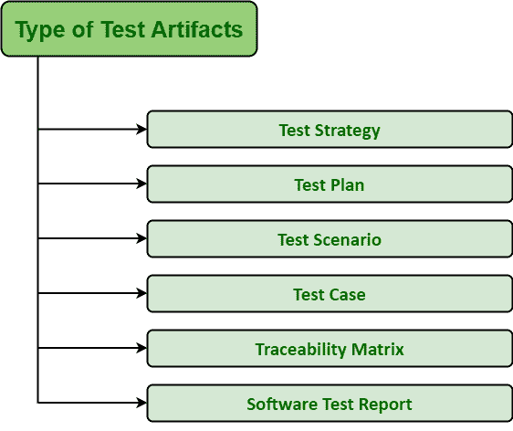

# 测试工件介绍

> 原文:[https://www . geesforgeks . org/测试工件介绍/](https://www.geeksforgeeks.org/introduction-of-test-artifacts/)

**测试工件**只是软件测试不可分割的一部分。这些通常是软件项目测试人员在软件测试生命周期中得到的一组文档。测试工件是在执行软件测试时生成或创建的副产品。然后，这些生成的测试工件与客户和测试团队或团队经理、团队领导、与项目相关的涉众以及其他团队成员共享。

简单地从客户处获得签准，以便在需要什么方面没有沟通缺口。这些工件在与成形产品相同的工件集合中进行交流、设计、构建或开发。这些工件也以可编程和可重复的格式实现，例如软件程序。在团队成员之间建立透明度是测试工件的主要目标和目的。因此，它们以适当的方式被记录，具有准确和准确的数据或信息和细节。

由于这一点，识别和跟踪变更以及了解需求测试活动的最新进展是非常容易和简单的，因为一切都被正确地记录了下来。这些工件的开发人员使用的工具、技术和培训与软件工程师在开发或创建最终产品时使用的相同。

**测试工件类型:**

**1。测试策略:**
测试策略一般由管理层的测试或项目经理制定。它是描述软件开发周期的测试方法的文档大纲，该文档列出了如何使用可用的资源达到预期的结果。

它只是简单地提供了对目标、工具、技术、基础设施和将要执行的测试活动的时间安排的简单理解。它还用于识别测试过程中可能出现的所有风险因素，以及降低或减轻风险的适当解决方案。它还阐明了完成项目所有测试过程的主要重要挑战和方法。测试策略通常来源于业务需求规范格式。为了制定这一战略，有几点需要牢记在心。其中一些如下:

*   测试的主要目标是什么，为什么要执行这个测试？
*   执行测试需要遵循哪些指南？
*   测试所需的所有需求是什么，比如功能需求、测试场景、资源等等。？
*   完成测试的每个职能和项目经理的角色和职责是什么？
*   有哪些不同级别的测试？
*   这次测试的主要成果是什么？
*   除了项目风险，测试还有哪些风险？
*   有什么方法可以解决可能出现的问题吗？

**2。测试计划:**
测试计划是描述软件测试范围、测试策略、测试可交付成果、风险、目标和活动的详细文档。它是通常用于软件应用程序测试的系统方法。简单地确保在基线计划中有任务和里程碑的初始列表来跟踪或识别项目进度是最重要和最基本的活动。

它是动态文档，通常作为参考点，并且仅基于在质量保证团队中进行的测试。它只是解释测试活动如何在项目中进行的蓝图。开发测试策略需要记住几个要点。其中一些如下:

*   测试活动的主要目的是什么？
*   测试的未来范围是什么，即执行测试时需要遵循或覆盖的确切路径？
*   什么是测试方法，即如何进行测试？
*   测试需要哪些资源？
*   测试完成后的退出标准是什么，即完成测试需要满足的一组条件和活动？
*   您将如何管理可能出现的风险？

**3。测试场景:**
测试场景是用于描述可测试应用程序功能的语句。它只是用来确保特性或软件的端到端测试是否运行良好。它源自用例。

它在应用程序表单中包含可以开发许多测试用例的情况或条件。测试场景也被称为测试条件或测试可能性。单个测试场景中可以容纳一个或多个测试用例。因此，测试场景与测试用例具有一对多的关系。它意味着详细地谈论和思考需求。

**4。测试用例:**
测试用例是一个详细的文档，描述了在测试时有助于执行的用例。它是由测试用例名称、前提条件、步骤/输入条件和预期结果组成的文档。测试用例的开发也有助于识别或跟踪软件应用程序需求或设计中的问题。

它只是一组条件或变量，在这些条件或变量下，软件测试人员将识别被测系统是否满足要求或以正确的方式工作。为了编写好的测试用例，需要在测试用例中包含一些要点:

*   编写测试用例 id，即测试用例的唯一标识号。
*   编写测试用例名称，即测试用例的强标题。
*   写下关于测试用例的全部细节和描述。
*   分步骤写，使其清晰简洁，即简单。
*   写下测试的预期或实际结果。

**5。可追溯性矩阵:**
可追溯性矩阵是包含表格的矩阵，这些表格显示并解释了需求和测试用例之间的多对多关系。它实际上是将任何需要多对多关系来检查、跟踪和映射关系的双基线文档关联起来的文档。它通常有助于确保软件测试产品的透明度和完整性。

它是用测试用例跟踪客户的所有需求并识别缺陷。追溯矩阵有两种类型:向前追溯矩阵和向后追溯矩阵。可追溯性矩阵中包含的一些参数如下:

*   需求标识。
*   需求类型和描述。
*   测试设计的状态以及测试状态的执行。
*   系统和单元测试用例。

**6。软件测试报告:**
软件测试报告是描述所有测试活动的文档。它提供了关于给定范围的测试用例、测试套件或测试脚本状态的详细信息。非常需要一份测试报告来以正式的方式表示测试结果，以便有机会快速找到测试结果。测试报告可以有多种类型:个人测试报告、团队报告。测试报告可以每天生成，也可以在测试完成后或测试周期结束时生成。