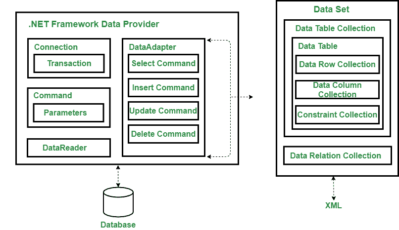

# ADO.NET 简介

> 原文:[https://www.geeksforgeeks.org/introduction-to-ado-net/](https://www.geeksforgeeks.org/introduction-to-ado-net/)

那个。NET 框架包括自己的数据访问技术，即**ADO.NET。**ADO.NET 是微软通用数据访问战略的最新实施地。ADO.NET 由托管类组成，允许。NET 应用程序连接到数据源，如微软 SQL Server、微软 Access、Oracle、XML 等。，执行命令并管理断开的数据..t

微软 ADO.NET 是 ADO 之后的最新改进。首先，ADO.NET 是在第 10<sup>版本中引入的。NET 框架，它有助于提供各种功能的广泛阵列，以不同的模式处理数据，例如连接模式和断开模式。在连接模式下，我们处理实时数据，在断开模式下，数据从数据存储中提供。
开发 ADO.NET 主要是为了解决我们从数据源获得的数据的两种处理方式。这两种方式如下:</sup>

1.  第一个是用户需要一次性访问数据，并在单个实例中遍历数据集合。
2.  处理数据的第二种方式是断开架构模式，在这种模式下，我们必须获取一组数据，并与数据存储本身分开使用这些数据。

**ADO.NET 建筑:**
ADO.NET 采用多层建筑，围绕以下几个关键概念

*   rsconnection
*   命令
*   数据集对象

ADO.NET 的架构和 ADO 有点不一样，从下图 ADO.NET 的架构可以看出来。



ADO.NET 建筑

ADO 和 ADO.NET 之间的一个关键区别是它们如何应对不同数据源的挑战。在 ADO.NET，程序员总是使用一组通用的对象，不管底层数据源是什么。**例如，**如果我们想从 Oracle 数据库中检索一条记录，我们使用与处理 SQL Server 相同的连接类。ADO.NET 的情况并非如此，它使用数据提供者模型和数据集。

**ADO.NET 的特色:**
以下是 ADO.NET 的特色–

*   **互操作性-**
    我们知道 XML 文档是基于文本的格式。因此，人们可以使用标准的文本编辑工具来编辑 XML 文档。ADO.NET 在所有数据交换和内部数据表示中使用 XML。
*   **可维护性–**
    ADO.NET 围绕着数据逻辑和用户界面分离的思想构建。这意味着我们可以在独立的层中创建我们的应用程序。
*   **可编程性(类型化编程)–**
    这是一种使用用户词来构造语句或计算表达式的编程风格。例如:如果我们想从“学生”表的“卡瓦尔”中选择“标记”列，以下是这样做的方法:

```
DataSet.Student("Kawal").Marks;
```

*   **性能–**
    它使用断开的数据架构，这种架构易于扩展，因为它减少了数据库的负载。一切都在客户端处理，因此提高了性能。
*   **可扩展性–**
    它意味着满足不断增长的客户端数量的需求，这降低了性能。由于它使用断开的数据访问，应用程序不会长时间保留数据库锁连接。因此，它通过鼓励程序员节省有限的资源并允许用户同时访问数据来适应可伸缩性。