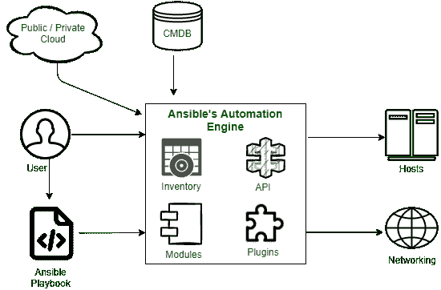

# ansi ble 及其架构组件介绍

> 原文:[https://www . geeksforgeeks . org/ansi ble 及其架构组件简介/](https://www.geeksforgeeks.org/introduction-to-ansible-and-its-architecture-components/)

在本文中，我们将讨论 ansible 的概述，并将主要关注其体系结构部分。我们一个一个来讨论。

**概述:**
Ansible 是一款 [IT 自动化](https://www.geeksforgeeks.org/overview-of-it-automation/)引擎，可以自动化各种 IT 需求。它具有应用程序部署等功能，这意味着您可以根据需求轻松部署应用程序，云资源调配、配置管理也是您可以配置和描述自动化作业以及服务内协调的主要功能。在这种情况下，(另一种标记语言)YAML 用于配置，这有助于根据需求描述自动化作业。它是为多层部署设计的，Ansible 通过描述不同系统之间的相互关系来建模信息技术基础设施，而不是一次管理一个系统。

**特征:**

*   在这种情况下，它不使用额外的功能和成本，就像没有代理和额外的定制安全基础设施一样，因此易于部署。
*   它使用了一种非常简单的语言，叫做 YAML(又一种标记语言)，以可翻译剧本的形式，你可以根据你的需求来配置它，它有助于用看起来像基础英语的方式描述自动化工作。
*   可移植自动化引擎与编写剧本的用户直接交互，还与云服务和配置管理数据库(CMDB)交互。

**架构组件:**
在这里，我们将讨论架构部分，并将讨论其组件。Ansible 自动化引擎由如下所述的各种组件组成。

ANSIBLE 架构图

*   **清单–**
    清单是主机及其 IP 地址、服务器和数据库的列表，对于 UNIX、Linux 或网络设备，必须通过 SSH 进行管理，对于 Windows 系统，必须通过 WinRM 进行管理。

*   **应用程序接口–**
    应用程序编程接口被用作公共和私有云服务的一种传输模式。

*   **模块–**
    模块通过行动手册直接在远程主机上执行，可以控制服务、包、文件等资源，或者执行系统命令。它们作用于系统文件，安装软件包，并对服务网络进行 API 调用。有超过 450 个 Ansible 提供了在环境中自动化各种作业的模块。例如，像云形成这样的云模块创建或删除 AWS 云形成堆栈。

*   **插件–**
    插件是增强 Ansible 核心功能的代码片段，允许执行 Ansible 任务作为作业构建步骤。Ansible 附带了几个方便的插件，你也可以自己编写。例如，动作插件充当模块的前端，可以在调用模块本身之前在控制器上执行任务。

*   **联网–**
    ansi ble 使用简单、强大且无代理的自动化框架来自动化网络任务。它使用单独的数据模型，并跨越不同的网络硬件。

*   **主机–**
    主机是指由 Ansible 自动化的节点或系统(Linux、Windows 等)。

*   **行动手册–**
    行动手册是以 YAML 格式编写的简单文件，描述了 Ansible 要执行的任务。行动手册可以声明配置，编排任何手动订购流程的步骤，还可以启动各种任务。

*   **CMDB–**
    代表配置管理数据库(CMDB)。在这种情况下，它将数据保存到一组信息技术资产中，它是一个存储库或数据仓库，我们将在其中存储这种数据，它还定义了这些资产之间的关系。

*   **Cloud–**
    它是一个由托管在互联网上的远程服务器组成的网络，用于存储、管理和处理数据，而不是将其存储在本地服务器上。