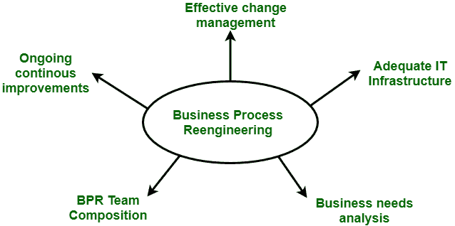

# 业务流程再造介绍

> 原文:[https://www . geesforgeks . org/业务流程再造入门/](https://www.geeksforgeeks.org/introduction-to-business-process-re-engineering/)

据**迈克尔·哈默博士**，

> “业务流程再造是对业务流程的根本反思和彻底设计，旨在实现关键的当代绩效指标(如成本、质量、服务和速度)的显著改善。”

**业务流程再造**不仅仅是一个变化，实际上是一个戏剧性的变化和戏剧性的改进。这只能通过彻底改革组织结构、职务说明、绩效管理、培训以及最重要的信息技术即信息技术的使用来实现。

**图:**业务流程再造

业务流程再造项目有时未能达到很高的期望。许多不成功的业务流程重组尝试都是由于围绕业务流程重组及其执行方式的混乱。这就变成了试错的过程。

**BPR 的阶段:**
按照彼得·德鲁克的说法，“再造是新的，必须要做。”业务流程再造有 7 个不同的阶段。所有的业务流程重组项目都是从最关键的需求开始的，即整个组织的沟通。

1.  开始组织变革。
2.  建立重组组织。
3.  确定业务流程再造机会。
4.  了解现有流程。
5.  重新设计流程
6.  设计新的商业系统。
7.  执行转换。

**业务流程重组的目标:**
以下是业务流程重组的目标:

1.  大幅降低成本。
2.  减少时间需求。
3.  大幅改善客户服务。
4.  重塑商业的基本规则，如航空业。
5.  顾客满意。
6.  组织学习。

**BPR 流程面临的挑战:**
所有的 BPR 流程都没有描述的那么成功。已经开始使用业务流程再造项目的公司面临以下许多挑战:

1.  抵抗
2.  传统
3.  时间要求
4.  费用
5.  失业

**流程再造的优势:**
流程再造的优势如下:

1.  BPR 提供了不同模块之间的紧密集成。
2.  它为业务提供相同的视图，即相同的数据库、一致的报告和分析。
3.  它提供流程导向设施，即简化流程。
4.  它提供了丰富的功能，如模板和参考模型。
5.  它是灵活的。
6.  它是可扩展的。
7.  它可以扩展。

**流程再造的劣势:**
流程再造的优势如下:

1.  这取决于各种因素，如资源的规模和可用性。所以，它不会适合每一个企业。
2.  它不能立即解决问题。