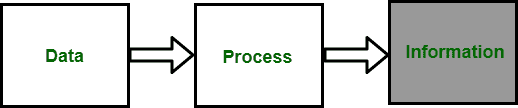

# 数据处理入门

> 原文:[https://www . geesforgeks . org/数据处理入门/](https://www.geeksforgeeks.org/introduction-to-data-processing/)

**数据处理**是指对数据进行处理，即转换其格式。众所周知，数据是非常有用的，当它被很好地呈现出来，它就变得信息丰富+有用。数据处理系统也称为**信息系统**。说数据处理成为将信息转换成数据的过程也是正确的，反之亦然。

简单地说，数据处理可以表示为:

*   以计算机可理解的格式转换数据的过程。
*   计算机对数据的分类或处理。

**数据处理的类型:**
数据处理大致分为两类:商业、科学和实时数据处理。这些解释如下。

1.  **业务数据处理:**
    会计或业务管理中的数据处理过程简称业务或行政数据处理。在这种类型的数据处理中，数据通常是数字形式的。它指的是企业中发生的所有计算功能。面向业务数据处理的计算机将需要高速输入和输出，以便可以轻松地将存储的数据转换为报告格式。
2.  **科学数据处理:**
    科学和工程问题中的数据处理被称为科学数据处理。基本上，它是计算机模拟和其他形式的计算在各种科学学科问题上的应用。它的特点是输入和输出相对较少，但内部计算量很大。它强调高速内部处理，但可能具有有限的输入和输出能力。
3.  **实时数据处理:**
    有许多类型的大型应用程序可能需要实时数据处理。在这种情况下，结果在数据输入的同时呈现。我们可以很容易地分析股票市场和货币趋势中的这种数据处理。实时数据处理中最常用的技术是流处理。

**数据处理优势:**

*   高效
*   节省时间
*   高速的
*   减少错误

**数据处理的缺点:**

*   功耗大
*   占用大量内存
*   安装成本很高
*   内存浪费