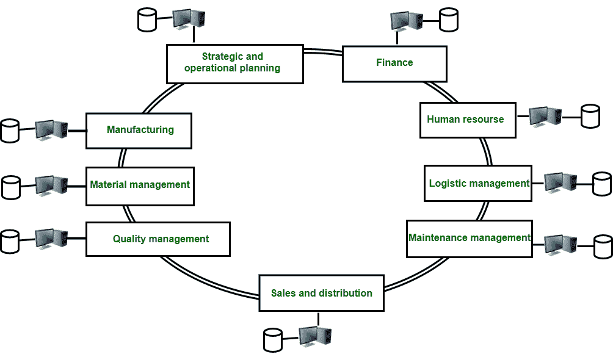
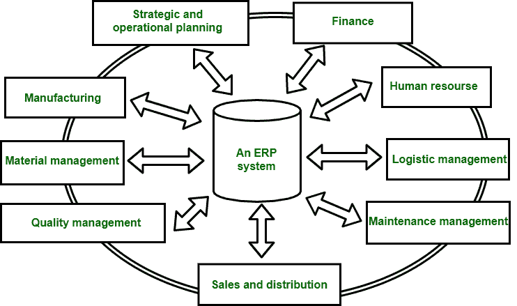

# ERP 简介

> 原文:[https://www.geeksforgeeks.org/introduction-to-erp/](https://www.geeksforgeeks.org/introduction-to-erp/)

ERP 代表[企业资源计划](https://practice.geeksforgeeks.org/problems/what-is-enterprise-resource-planning-erp-and-what-kind-of-a-database-is-used-in-an-erp-application)。

企业资源规划系统是一种用于管理企业数据的软件工具。ERP 系统帮助不同的组织处理企业的不同部门。不同的部门像收货、库存管理、客户订单管理、生产计划、发货、会计、人力资源管理等业务职能。

基本上，它是将一个企业的计划、制造、销售和营销工作整合到一个管理系统中的实践。它将不同部门的所有数据库组合成一个单一的数据库，该企业的所有员工都可以轻松访问该数据库。它有助于执行业务流程所涉及的任务的自动化。

1.  **Before ERP :**

    图–企业资源规划之前

    在企业资源规划系统之前，不同部门有不同的数据库，由他们自己管理。一个部门的员工对另一个部门一无所知。

2.  **After ERP :**

    图–企业资源规划后

    在企业资源规划系统之后，不同部门的数据库由一个称为企业资源规划系统的系统管理。它跟踪系统中的所有数据库。在这种情况下，一个部门的员工拥有关于其他部门的信息。

3.  **企业资源规划供应商:**
    *   你的工作
    *   JD 爱德华兹
    *   神谕
    *   PeopleSoft
    *   [SAP](https://www.geeksforgeeks.org/sap-an-introduction/)
4.  **ERP 的优势:**
    *   该系统有助于提高集成度。
    *   这是一个灵活的系统。
    *   这个系统的错误比较少。
    *   这个系统提高了速度和效率。
    *   完全可以获得信息。
    *   降低整个供应链的总成本。
    *   该系统有助于缩短生产时间。
    *   高层管理人员的持续参与和承诺。
5.  **Limitations of ERP :**

    企业资源规划系统有三个明显的局限性:

    *   经理只能在程序员的帮助下生成自定义报告或查询，这将产生一个问题，即他们不能快速接收信息，而这对于获得竞争优势至关重要。
    *   没有适当的决策方案，即该系统仅提供当前状态，如未结订单。每当需要寻找过去的状态来发现趋势和模式时，这就变得很困难。这有助于更好的决策。
    *   毫无疑问，数据是集成在系统内的，但没有数据与其他企业或部门系统的集成，也不包括外部智能。