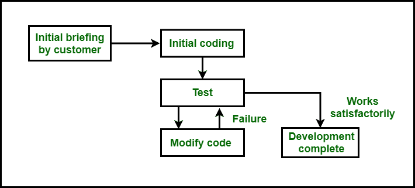
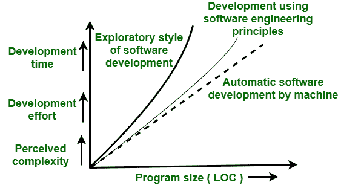

# 软件开发探索性风格介绍

> 原文:[https://www . geesforgeks . org/探索式软件开发简介/](https://www.geeksforgeeks.org/introduction-to-exploratory-style-of-software-development/)

**探索性程序开发风格**指的是一种**非正式开发**风格，在这种风格中，程序员利用自己的直觉来开发程序，而不是利用软件工程学科下的系统知识。这种开发方式给了程序员完全的自由去选择他们喜欢开发软件的活动。这种风格不提供任何开始开发任何软件的规则。下面的框图将阐明与该模型相关的一些事实:

图–软件开发的探索式风格

在上图中，第一个方框是客户的**初始简报**，即客户对问题的简要介绍。简报后，控制转到**初始编码**，即一旦开发人员或程序员知道问题，他就开始编码开发工作程序，而不考虑任何类型的需求分析。在此之后，程序将被**测试**，即发现 bug，并由程序员修复。这个循环一直持续到没有获得满意的代码。找到满意的代码后，开发就完成了。

**用法:**
这种风格的软件开发只用于小程序的开发。现在，这种风格只被实验室的学生用来完成作业。这种风格在现在的工业中并不多见。

**这个模式有什么问题？**
在探索性开发场景中，开发专业软件所需的工作量和时间随着程序规模的增加而增加。下图显示了随着问题规模的增加，开发工作和时间的增加:

图–随着问题规模的增加，开发时间和工作量增加。

在上图中，**粗线**绘制表示使用探索式开发程序的情况。随着程序规模的增加，所需的工作量和时间几乎呈指数级增长。对于大问题，使用探索式开发方式开发程序需要太长的时间和太多的成本才有实际意义。探索性开发方法被认为是在待开发程序的规模增加到超过一定值后分解。

**细实线**用于表示使用软件工程原理进行开发时的情况。在这种情况下，就有可能用努力和时间来解决一个在程序大小上几乎是线性的问题**虚线**用于表示当由自动化机器进行开发时的情况。在这种情况下，工作量和时间随着规模的增加会更接近于规模的线性增加。

由于人类认知的限制，探索性风格导致问题的感知难度呈指数增长。你可能还在想，当使用软件工程原理时，为什么曲线不会变成完全线性？答案是，应用分解和抽象原则来完全克服问题的复杂性是非常困难的。

**该型号的缺点:**

*   使用这种模型，随着问题规模的增加，开发时间和工作量呈指数级增长，使用这种开发方式，大规模软件变得几乎不可能。
*   这种开发风格会导致无法维护的代码，因为没有规划的编程总是会导致代码的非结构化和低质量。
*   此外，当有一个合适的开发团队时，很难使用这种风格，因为在这种风格中，每个开发人员都使用自己的直觉来开发软件。