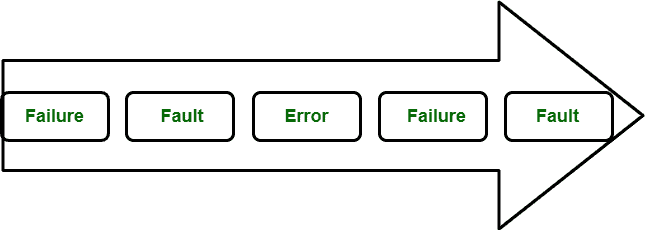
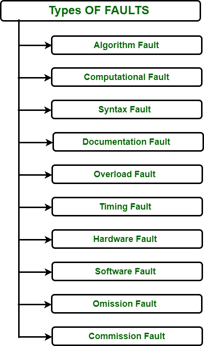

# 软件工程故障介绍

> 原文:[https://www . geesforgeks . org/软件工程故障介绍/](https://www.geeksforgeeks.org/introduction-to-faults-in-software-engineering/)

**故障:**
它是计算机程序中任何过程和数据定义的不正确步骤，对计算机中任何程序的非预期行为负责。硬件或软件中的故障或 bug 可能会导致错误。错误可以被定义为导致系统故障的系统的一部分。基本上，程序中的错误是失败发生或已经发生的指示。

如果系统有多个组件，该系统中的错误将导致组件故障。由于系统中有许多组件相互作用，一个组件的故障可能会导致系统中出现一个或多个故障。以下循环显示故障的行为。

**图:故障行为**

**故障类型:**
在软件产品中，可以发生不同类型的故障。为了排除故障，我们必须知道我们的程序面临什么类型的故障。以下是故障类型:

**图:故障类型**

1.  **算法故障:**
    当组件算法或逻辑由于错误的处理步骤而不能为给定的输入提供正确的结果时，就会发生这种类型的故障。通过读取程序，即磁盘检查，可以很容易地将其删除。
2.  **计算故障:**
    当故障磁盘实现错误或无法计算所需结果时，就会出现这种类型的故障，例如，组合整数和浮点变量可能会产生意想不到的结果。
3.  **语法错误:**
    这种类型的错误发生是由于在程序中使用了错误的语法。我们必须为我们正在使用的编程语言使用正确的语法。
4.  **文档故障:**
    程序中的文档告诉程序实际做什么。因此，当程序与文档不匹配时，就会出现这种情况。
5.  **过载故障:**
    出于内存目的，我们使用了数组、队列和堆栈等数据结构。在我们的节目中。当它们充满了给定的容量，而我们超出了它们的容量时，我们的程序就会出现过载故障。
6.  **定时故障:**
    当程序中出现故障后系统没有响应时，这种类型的故障称为定时故障。
7.  **硬件故障:**
    当给定软件的指定硬件无法正常工作时，就会出现这种故障。基本上是因为规格中没有规定的硬件延续问题。
8.  **软件故障:**
    可能发生在指定软件工作不正常或者不支持所使用的平台或者我们可以说操作系统的时候。
9.  **遗漏故障:**
    当程序中缺少关键方面时，例如当程序中没有完成变量的初始化时，就会出现这种故障。
10.  **佣金故障:**
    当表达式的语句错误，即整数用 float 初始化时，会出现这种情况。

**故障避免:**
可以通过使用旨在避免在安全相关系统的安全生命周期的任何阶段引入故障的技术和程序来避免程序中的故障。

**:**
容错是功能单元即使在出现故障的情况下也能继续执行所需功能的能力。