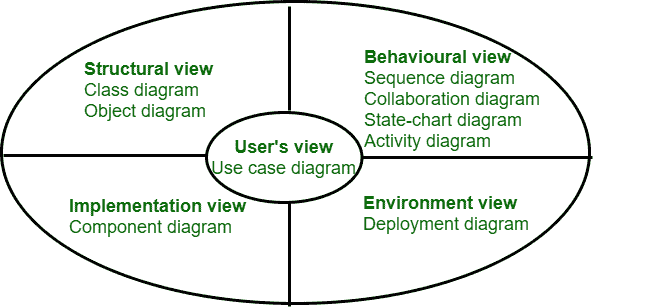

# UML 图介绍

> 原文:[https://www.geeksforgeeks.org/introduction-to-uml-diagrams/](https://www.geeksforgeeks.org/introduction-to-uml-diagrams/)

为了表示软件系统的不同视角，使用了主要完全基于统一建模语言(统一建模语言)的不同的 [UML](https://www.geeksforgeeks.org/unified-modeling-language-uml-introduction/) 图。每个视角都聚焦于某个特定的方面，而忽略了其他方面。有些人可能还会问，为什么要从不同的角度构建几个模型——为什么不仅仅构建一个能够捕捉所有视角的模型呢？这个问题的答案是: **如果做一个单一的模型来捕捉所有需要的视角，那么它就会像原来的问题一样复杂，用处不大。** 一旦从所有需要的角度对系统进行了建模，构建的模型就可以被细化以获得系统的实际实现。它将整个软件系统分为组件和子组件。

**通过使用 UML 图可以捕捉到的众多视角如下:**

*   用户视图
*   结构视图
*   行为观点
*   实施视图
*   环境观点

UML 中支持不同类型的图和透视图

这些解释如下。

1.  **用户视图:**
    用户视图定义了设备的众多功能，这些功能必须提供给用户。**该视图根据系统向用户提供的功能来捕捉系统的视图。**这个视图就像一个黑盒，里面隐藏着系统的各种细节，比如内部结构、实现等，不让用户看到。它的视图被称为中心视图，因为所有其他视图都必须符合这个视图。即使对于面向对象的开发来说，我们也需要一个功能视图，这确实是值得注意的。这是因为，毕竟，用户认为系统提供了一组功能。

2.  **结构视图:**
    从名称结构视图来看，这个视图定义了问题的结构。问题的结构可以根据对象或类来定义，这对于理解系统的工作及其实现非常重要。该视图还用于捕获对象或类之间的关系。这种观点被称为**静态模型**，其背后的原因是系统的结构不会随着时间而变化。

3.  **行为观:**
    这个观点定义了对象之间是如何相互作用的，只是为了实现系统行为。因此，它构成了被称为系统的**动态模型**，其背后的原因是它捕捉到了系统的**时间相关(动态)**行为。

4.  **实现视图:**
    该视图捕获了系统的各个重要组件及其相互依赖关系。**例如**实现视图可能会将**图形用户界面**部分、**中间件**和**数据库**部分显示为不同的部分，并且还会捕获它们的相互依赖关系。

5.  **环境视图:**
    该视图描述了众多添加剂在硬件特定部分的实现。对于一个平滑的系统，利用**案例模型**、**类图、**和 i **交互图**中的一个也是足够的。对于对象经历许多状态变化的系统，状态图也是必要的。对于在大量硬件组件上实现的系统，部署图也是必要的。因此，要构建的模型种类取决于手头的事情。