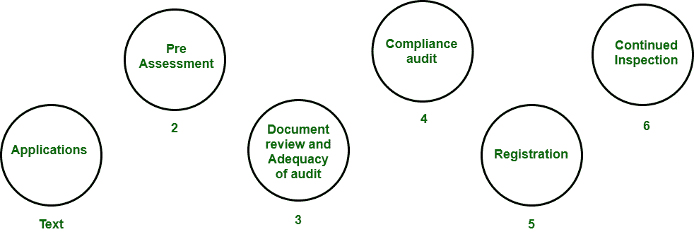

# 软件工程 ISO 9000 认证

> 原文:[https://www . geesforgeks . org/iso-9000-软件工程认证/](https://www.geeksforgeeks.org/iso-9000-certification-in-software-engineering/)

国际标准化组织是一个世界性的国家标准机构联盟。**国际标准组织(ISO)** 是作为独立各方之间合同的标准。它规定了**质量体系**的开发指南。

组织的质量体系是指与其产品或服务相关的各种活动。国际标准化组织标准涉及两个方面，即操作和组织方面，包括责任、报告等。ISO 9000 标准包含一套不考虑产品本身的生产过程指南。

**ISO 9000 认证**

**为什么软件行业需要 ISO 认证？**
软件行业必须获得 ISO 认证有几个原因。一些原因如下:

*   这一认证已成为国际招标的标准。
*   它有助于设计高质量的可重复软件产品。
*   它强调需要适当的文档。
*   它有助于开发最佳流程和全面的质量测量。

**ISO 9001 要求的特点:**

*   **文档控制–**
    所有与软件产品开发相关的文档都应该得到适当的管理和控制。
*   **规划–**
    应准备并监控适当的计划。
*   **审核–**
    为了有效性和正确性，所有阶段的所有重要文件都应独立检查和审核。
*   **测试–**
    产品应按照规格进行测试。
*   **组织方面–**
    应解决各种组织方面的问题，例如质量团队的管理报告。

**ISO 9000 认证的优势:**
ISO 9000 认证流程的一些优势如下:

*   商业 ISO-9000 认证迫使一家公司专注于“他们是如何做生意的”。每个程序和工作指令都必须记录在案，从而成为持续改进的跳板。
*   当员工被要求控制他们的流程并记录他们的工作流程时，他们的士气会提高
*   更好的产品和服务源于持续改进过程。
*   增加员工的参与、投入、意识和系统的员工培训是减少问题的方法。

**ISO 9000 认证的缺点:**
ISO 9000 认证过程的一些缺点如下:

*   ISO 9000 没有给出任何定义适当过程的指导方针，也没有给出高质量过程的保证。
*   ISO 9000 认证过程中没有国际认证机构存在。