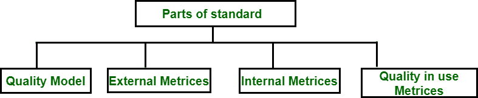
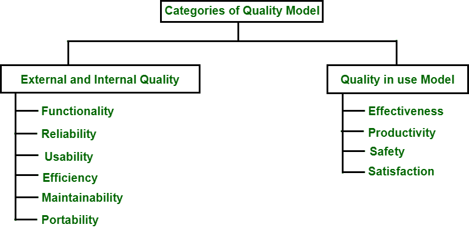

# 软件工程 ISO/IEC 9126

> 原文:[https://www . geesforgeks . org/iso-iec-9126-in-software-engineering/](https://www.geeksforgeeks.org/iso-iec-9126-in-software-engineering/)

**国际标准化组织/IEC 9126** 是一项国际标准，旨在确保**“所有软件密集型产品的质量”**，其中包括安全关键型系统，一旦出现故障，软件生命将受到威胁。ISO 即国际标准组织和 IEC 即国际电气组织制定了软件工程的 ISO/IEC 9126 标准–>**产品质量**为软件产品的质量提供了一个包罗万象的规范和**评估模式** l。

该标准分为 4 个部分，如下图所示:

**第 1 部分软件工程-产品质量“质量模型”:**
它描述了质量模型框架，该框架解释了不同质量方法之间的关系，以及识别软件产品的质量特征和子特征。

**第 2 部分软件工程-产品质量“外部度量”:**
它的用途是描述用于测量第 1 部分中确定的特征和子特征的外部度量。

**第 3 部分软件工程-产品质量“内部度量”:**
它的用途是描述用于测量第 1 部分中确定的特征和子特征的内部度量。

**第 3 部分软件工程-产品质量“使用中的质量度量”:**
它的用途是识别度量用户综合质量特征效果的度量。

从以上讨论可以得出结论，前三部分涉及软件产品质量的描述和度量，第四部分从用户的角度关注软件产品的质量。

此外，第一部分(即质量模型)分为两类，如下图所示:

**内部外部质量部分:**它通过功能性、可靠性、可用性、效率性、可维护性和可移植性六个特征来决定软件产品的质量。每个特征被细分为相关的子特征，这些子特征也在上面的例子中描述。

1.  **功能:**功能是那些将满足隐含需求的功能。
    *   适合
    *   准确(性)
    *   互用性
    *   安全
    *   功能合规性
2.  **可靠性:**将影响软件保持性能水平的能力的一组属性。
    *   成熟度
    *   容错
    *   可复性
    *   可靠性符合性
3.  **可用性:**一组与隐含的一组用户使用所需的努力有关的属性。
    *   易懂
    *   学习能力
    *   可操作性
    *   吸引力
    *   可用性合规性
4.  **效率:**在规定条件下，影响软件性能水平之间关系的一组属性。
    *   时间行为
    *   资源利用
    *   效率合规
5.  **可维护性:**一组与进行特定修改所需的努力相关的属性。
    *   可分析性
    *   可变性
    *   稳定性
    *   易测性
    *   可维护性符合性
6.  **可移植性:**影响软件从一个环境转移到另一个环境的能力的一组属性。
    *   适应性
    *   可安装性
    *   共存
    *   替换能力
    *   便携性合规性

**在用质量模型:**它确定了四个质量特征，即有效性、生产率、安全性、满意度。