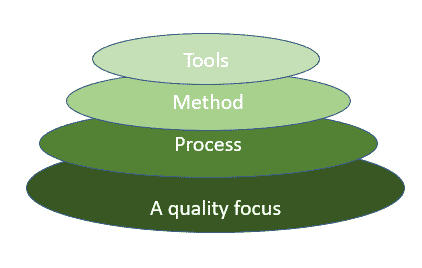
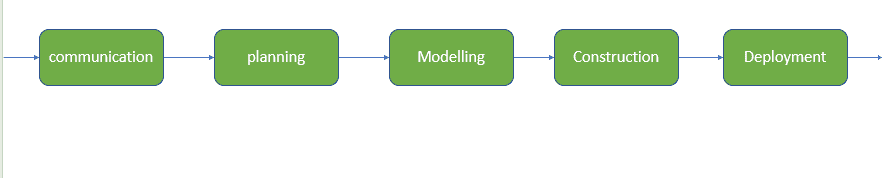

# 软件工程中的分层技术

> 原文:[https://www . geesforgeks . org/分层软件工程技术/](https://www.geeksforgeeks.org/layered-technology-in-software-engineering/)

[软件工程](https://www.geeksforgeeks.org/software-engineering-introduction-to-software-engineering/)完全是一个分层的技术，要开发软件我们需要从一层到另一层。所有的层都是连接的，每一层都要求完成前一层。

图:该图展示了软件开发的层次

### **分层技术分为四个部分:**

**1。** **一个质量焦点:**它定义了软件的持续过程改进原则。它提供了完整性，这意味着为软件提供了安全性，因此数据只能由授权人员访问，任何外部人员都不能访问数据。它还关注可维护性和可用性。

**2。流程:**是软件工程的基础或基础层。关键是将所有层绑定在一起，这使得软件能够在截止日期之前或按时开发。过程定义了有效交付软件工程技术必须建立的框架。软件过程包括软件开发所需的所有活动、动作和任务。

**过程活动如下:-**

*   **通信:**是软件开发的首要之事。沟通对于了解客户的实际需求是必要的。
*   **规划:**基本上就是为了减少开发的复杂度而绘制地图。
*   **建模:**在这个过程中，为了更好的理解，会根据客户端创建一个模型。
*   **构造:**包括问题的编码和测试。
*   **部署:-** 包括将软件交付给客户进行评估和反馈。

**3。方法:**在软件开发过程中，所有“怎么办”问题的答案都是用方法给出的。它拥有所有任务的信息，包括通信、需求分析、设计建模、程序构建、测试和支持。

**4。** **工具:**软件工程工具为流程和方法提供了一个自操作系统。工具是集成的，这意味着一个工具创建的信息可以被另一个工具使用。