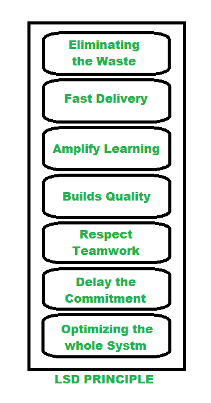

# 精益软件开发(LSD)

> 原文:[https://www . geesforgeks . org/lean-software-development-LSD/](https://www.geeksforgeeks.org/lean-software-development-lsd/)

**精益软件开发(LSD)** 是一个[敏捷框架](https://www.geeksforgeeks.org/software-engineering-agile-software-development/)，用于精简&优化软件开发流程。它也可以被称为最小可行产品(MVP)战略，因为这些思维方式非常相似，因为两者都旨在通过关注新的可交付成果来加快开发速度。

丰田被认为启发了精益开发方法，该方法旨在优化生产和最大限度地减少浪费。看到丰田的精益方法，许多其他制造团队开始遵循同样的策略。并且在 2003 年软件开发中首次采用。

**LSD 的优势:**
LSD 已经证明可以通过以下方式改善软件开发:

1.  LSD 在设计软件时删除了不必要的过程阶段，因此它可以节省时间，简化开发过程。
2.  以 MVP 为重点，精益软件开发优先考虑基本功能，因此消除了花费时间在无价值构建上的风险。
3.  随着越来越多的成员参与，它增加了您团队的参与能力，从而优化了整个工作流程，减少了损失。

**精益软件开发的关键原则:**
有 7 个既定的精益原则，它们伴随着一套构建更高效软件产品的策略、实践和流程:

1.  消除浪费
2.  快速交货
3.  放大学习
4.  构建质量
5.  尊重团队合作
6.  推迟承诺
7.  优化整个系统

下图说明了 LSD 的原理:

精益软件开发原则

**消除浪费:**识别并消除浪费，例如不必要的代码、流程延迟、沟通效率低下、质量问题、数据重复、日志中的任务多于完成的任务等。项目经理定期召开会议。这使得团队成员可以指出错误，并在下一轮中提出更改建议。

**快速交付:**以前，长时间的规划曾经是商业成功的关键，但随着时间的推移，人们发现工程师花了太多时间来构建具有不需要的功能的复杂系统。因此，他们想出了一个 MVP 策略，导致快速构建包含一点功能的产品，并将产品推向市场并观察反应。这种方法允许他们根据客户的反馈来改进产品。

**扩大学习:**通过大量的代码审查、跨团队适用的会议来提高学习。这也确保了特定的知识不是由一个编写特定代码的工程师积累的，所以使用成对编程。

**打造品质:** LSD 就是要防止浪费，盯紧不牺牲品质。开发人员经常在编写代码之前应用测试驱动编程来检查代码。质量也可以通过从团队成员和项目经理那里获得持续的反馈来获得。

**尊重团队合作** : LSD 注重的是赋能团队成员，而不是控制他们。建立一种合作的氛围，在期限短、工作量大的时候保持完美的平衡。当新成员加入一个成熟的团队时，这种方法变得非常重要。

**延迟承诺:**在传统的项目管理中，当你提出申请时，往往会发生这种情况，结果证明它完全不适合市场。LSD 方法认识到这种威胁，并通过推迟不可逆的决定，直到所有实验都完成，从而为改进留下空间。这种方法总是将软件构建得非常灵活，因此新知识是可用的，工程师可以进行改进。

**优化整个系统:**精益原则允许管理者将一个问题分解成小的组成部分，以优化团队的工作流程，在成员之间建立团结，并激发共同的责任感，从而提高团队绩效。

**LSD 的弱点:**

*   使它像其他框架一样可扩展，因为它强烈依赖于所涉及的团队。
*   这很难跟上步伐，所以开发人员与团队成员合作并不容易，因为他们之间可能会发生冲突。
*   这导致了一个困难的决策过程，因为客户必须清楚地设定他们对开发的要求，不得中断。

精益软件开发是通过生产力和清洁度来驱动你的身体的主动方法之一。它与敏捷方法、知识共享经验、快速产品交付紧密相连。开发的所有流程和阶段都经过精确构建，以便及时以最低成本交付最终产品。