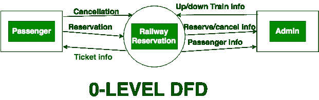
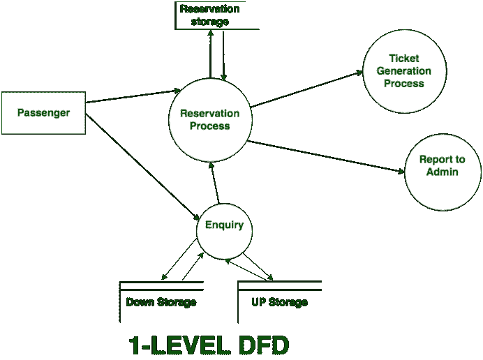
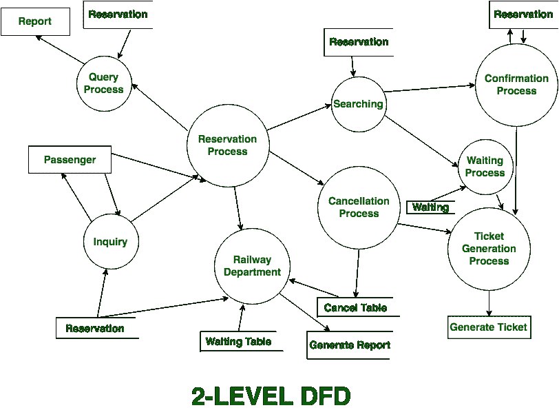

# 数据流图中的级别(DFD)

> 原文:[https://www . geesforgeks . org/levels-in-data-flow-diagrams-DFD/](https://www.geeksforgeeks.org/levels-in-data-flow-diagrams-dfd/)

在软件工程中，可以画出 DFD(数据流图)来表示不同抽象层次的系统。更高层次的 DFD 被划分为更低层次——窃取更多的信息和功能元素。DFD 的级别编号为 0、1、2 或更高。在这里，我们将在数据流图中主要看到 3 个级别，分别是:0 级 DFD、1 级 DFD 和 2 级 DFD。

**0 级 DFD:**
又称为脉络图。它被设计成一个抽象视图，将系统显示为一个单独的进程，并与外部实体建立关系。它将整个系统表示为单个气泡，输入和输出数据由输入/输出箭头指示。

**1 级 DFD:**
在 1 级 DFD，上下文图分解成多个气泡/进程。在这一层中，我们突出了系统的主要功能，并将 0 级 DFD 的高级过程分解为子过程。

**2 级 DFD:**
2 级 DFD 深入 1 级 DFD 部分地区一步。它可用于计划或记录系统运行的具体/必要细节。

