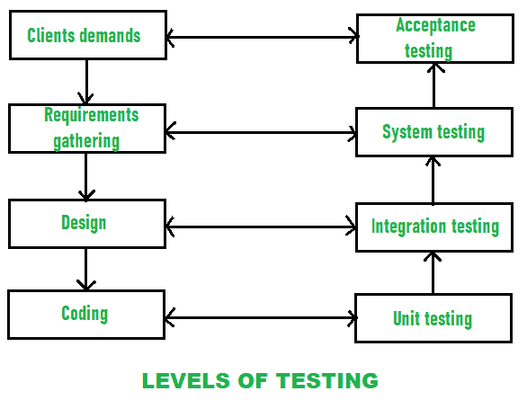

# 软件测试级别

> 原文:[https://www.geeksforgeeks.org/levels-of-software-testing/](https://www.geeksforgeeks.org/levels-of-software-testing/)

[软件测试](https://www.geeksforgeeks.org/software-testing-basics/)是一项识别错误的活动，这样可以消除错误，获得更高质量的产品。为了保证和维护软件的质量，并代表对规范、设计和编码的最终审查，需要进行软件测试。有不同级别的测试:

1.  **[单元测试](https://www.geeksforgeeks.org/unit-testing-software-testing/) :**
    在这种类型的测试中，通过单独测试软件的组件或单元，从每个组件或单元中单独检测错误，以确保它们是否适合开发人员使用。它是软件中最小的可测试部分。
2.  **[【集成测试】](https://www.geeksforgeeks.org/software-engineering-integration-testing/) :**
    在该测试中，两个或多个经过单元测试的模块被集成在一起进行测试，即技术交互组件，然后验证这些集成模块是否按照预期工作，并检测接口错误。
3.  **[系统测试](https://www.geeksforgeeks.org/system-testing/) :**
    在系统测试中，对完整的、集成的软件进行测试，即构成系统的所有系统要素进行整体测试，以满足系统的要求。

*   **[Acceptance Testing](https://www.geeksforgeeks.org/acceptance-testing-software-testing/) :**
    It is a kind of testing conducted to ensure whether the requirement of the users are fulfilled prior to its delivery and the software works correctly in the user’s working environment.

    这些测试可以在软件开发的不同阶段进行。下图显示了测试级别以及相应的软件开发阶段

    

    执行软件测试时，每个软件工程师都必须遵循[测试原则](https://www.geeksforgeeks.org/types-software-testing/):

    *   顾客的要求应该是可追溯的，并通过所有不同的测试来识别。
    *   应该在测试开始之前很久就计划如何进行测试。
    *   帕累托原则可以应用于软件测试——在测试期间识别的所有错误的 80%可能可追溯到所有程序模块的 20%。
    *   测试应该从“小”开始，并朝着“大”的方向发展。
    *   彻底的测试仅仅意味着测试所有可能的数据组合是不可能的。
    *   进行的测试应该是最有效的，为此，需要独立的第三方。