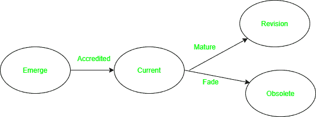

# 开放标准的生命周期

> 原文:[https://www.geeksforgeeks.org/life-cycle-of-open-standard/](https://www.geeksforgeeks.org/life-cycle-of-open-standard/)

无论我们在网上还是以传统方式开展业务，都有一种约定俗成的做事方式。这就是所谓的标准。例如，如果你计划建立制造床单的业务，那么按照标准，床单的最小长度需要 7 英尺长。这些标准可以正式公布，也可以通过非正式的非书面程序公布。

**我们为什么需要标准？**
作为消费者，标准帮助我们理解我们在购买什么——某样东西是否适合我们购买它的目的，以及它是否具有合适的质量。标准也使理解和比较竞争产品变得更加容易。随着标准在全球范围内被采纳并应用于许多市场，它们也推动了国际贸易。只有通过标准的应用，才能验证新产品和新市场的可信度。

**标准提供:**

1.  **安全性和可靠性–**
    用户认为标准产品更可靠，这也增加了他们对提供标准产品的公司的信任。

*   **支持政府政策和立法–**
    监管机构和立法者经常引用标准来保护用户和企业利益，并支持政府政策。*   **互操作性–**
    设备协同工作的能力依赖于符合标准的产品和服务。*   **Open up market access –**
    By increasing awareness of technical developments and initiatives.

    **什么是开放标准？**
    开放标准是包含可实施规范的公开文件。这些软件可供任何人使用和修改，例如，在互联网上免费提供的计算机软件，它提供原始源代码，以便高级用户可以修改。

    **开放标准的生命周期:**
    标准遵循生命周期，在这个周期中，它们不断成熟以适应环境的变化，或者在不再使用时逐渐消失。

    

    标准的生命周期

    1.  **浮现:**
        当一个新的标准正在开发或审查时，就知道它处于浮现阶段。这些标准正在等待认证机构的评估，公司没有使用。例子:航空列车，一组日本研究人员已经建造了一个悬浮在气垫上的航空列车原型。
    2.  **当前:**
        当新兴标准获得认可和批准并在工业中使用时，即被称为处于当前阶段。例子:电动火车——靠电力运行。
    3.  **过时:**
        当标准因环境变化而不被行业使用时，它们被称为过时。不变的标准很可能会随着时间的流逝而逐渐消失。此类标准通常被新标准所取代。例子:铁路蒸汽机车。
    4.  **修订:**
        标准随着行业的变化而演变，达到不同的成熟度水平。他们在效率和价值的驱动下走向成熟。例子:最初铁轨是用木头或混凝土连接的，现在已经升级为使用无碴轨道。

    **标准的优势:**

    *   **互操作性–**
        当一个产品按照标准生产时，该产品与其他公司生产的产品配合良好。
    *   **防止供应商锁定–**
        允许用户选择任何公司的产品，而无需担心其功能。
    *   **协同创新–**
        允许多个组织联合起来解决复杂问题。
    *   **更低的成本–**
        标准开发不涉及成本。
    *   **行动自由–**
        用户可以自由依赖多家公司提供服务，而不是依赖单一公司。