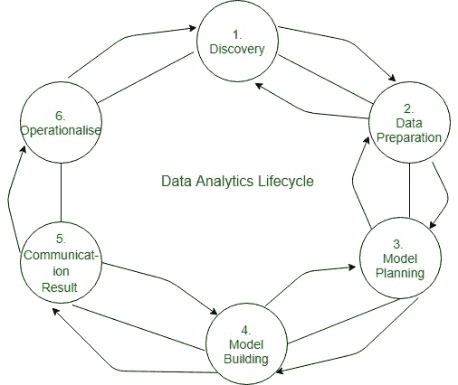

# 数据分析的生命周期阶段

> 原文:[https://www . geesforgeks . org/生命周期阶段数据分析/](https://www.geeksforgeeks.org/life-cycle-phases-of-data-analytics/)

在本文中，我们将讨论数据分析的生命周期阶段，其中我们将涵盖不同的生命周期阶段，并将逐一讨论它们。

**数据分析生命周期:**
[数据分析](https://www.geeksforgeeks.org/data-analytics-and-its-type/)生命周期是为大数据问题和数据科学项目而设计的。循环是迭代的，以代表真实的项目。为了满足对大数据执行分析的独特要求，需要一步一步的方法来组织与获取、处理、分析和重新调整数据用途相关的活动和任务。

**Phase 1: Discovery –**

*   数据科学团队学习并调查这个问题。*   发展背景和理解。*   了解项目所需和可用的数据源。*   The team formulates initial hypothesis that can be later tested with data.
    **Phase 2: Data Preparation –**

    *   建模和分析之前探索、预处理和调节数据的步骤。
    *   它需要一个分析沙箱，团队执行、加载和转换，以将数据放入沙箱。
    *   数据准备任务可能会执行多次，并且不是按照预定义的顺序执行的。
    *   这个阶段常用的几个工具是——Hadoop、Alpine Miner、Open Refine 等。
    **Phase 3: Model Planning –**
    *   团队探索数据以了解变量之间的关系，然后选择关键变量和最合适的模型。
    *   在这个阶段，数据科学团队为培训、测试和生产目的开发数据集。
    *   团队基于模型规划阶段所做的工作来构建和执行模型。
    *   这个阶段常用的几个工具是——Matlab、STASTICA。
    **Phase 4: Model Building –**
    *   团队为测试、培训和生产目的开发数据集。
    *   团队还考虑其现有工具是否足以运行模型，或者他们是否需要更健壮的环境来执行模型。
    *   免费或开源工具——兰德 PL/R、Octave、WEKA。
    *   商业工具——Matlab、STASTICA。
    **Phase 5: Communication Results –**
    *   在执行模型之后，团队需要将建模的结果与成功和失败的标准进行比较。
    *   团队考虑如何最好地向不同的团队成员和利益相关者阐明发现和结果，同时考虑警告、假设。
    *   团队应该确定关键的发现，量化业务价值，并发展叙述来总结和向利益相关者传达发现。
    **Phase 6: Operationalize –**
    *   该团队更广泛地宣传项目的好处，并建立试点项目，以受控的方式部署工作，然后将工作扩展到用户的整个企业。
    *   这种方法使团队能够在小规模生产环境中了解模型的性能和相关约束，并在完全部署之前进行调整。
    *   团队提供最终报告、简报和代码。
    *   免费或开源工具——Octave、WEKA、SQL、MADlib。

    