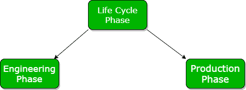
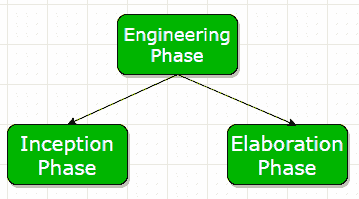
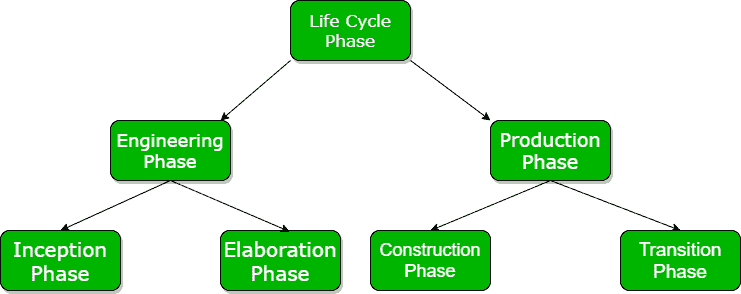
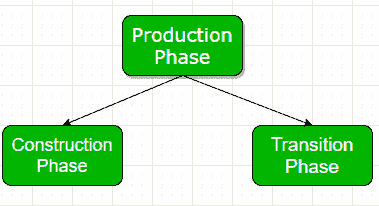

# 项目管理的生命周期阶段

> 原文:[https://www . geesforgeks . org/生命周期-项目管理阶段/](https://www.geeksforgeeks.org/life-cycle-phases-of-project-management/)

生命周期阶段由各种独立的模块组成，具有定义的功能。生命周期阶段描述了项目管理的各个阶段。生命周期阶段主要分为两大类:

```
1. Engineering Phase
2. Production Phase 
```



这些解释如下。

**1。工程阶段:**
工程阶段包括确立目标和定义项目的整体范围。工程阶段涉及小团队规模，通常预测较少。工程阶段进一步分为两个阶段:初始阶段和精化阶段。



*   **(一)。初始阶段-**
    初始阶段包括建立目标和收集软件开发所需的需求。它涉及成本估算和识别风险因素。在初始阶段，我们主要致力于项目和架构的范围。可行性分析也是初始阶段的一个重要部分。
*   **(ii). Elaboration Phase –**
    Elaboration phase involves in-depth evaluation and study as well as establishing the strong architecture and infrastructure. In the elaboration phase, we work on the efficiency of our architecture. In this phase, we also analyze use cases and other software diagrams. We reduce the risk to a certain extent and a preliminary user modules in prepared in this phase.

    

**2。生产阶段:**
在生产阶段，我们主要关注项目的实施和优化，包括降低项目的成本和风险因素。它还涉及项目高效部署的各种测试。它涉及到庞大的团队规模，大多数时候是可以预测的。大致分为两个阶段:建设阶段、过渡阶段。



*   **(一)。建设阶段–**
    在建设阶段，我们执行软件的实施。在这个阶段，我们将风险降到最低并消除它。所有功能和组件都集成到一个应用程序中。在这一阶段，我们执行严格的测试，并完成流程优化。我们将开发成本降至最低，并努力提高其效率。构建阶段主要关注我们软件的实现和测试。
*   **(二)。过渡阶段–**
    在过渡阶段，我们执行严格的测试，主要是软件或项目的测试和部署。在收到用户的反馈后，我们对软件进行一些修改，使其更加有效。在这一阶段，开发人员从用户的角度来处理一个项目，以使软件更易于支持和用户友好。