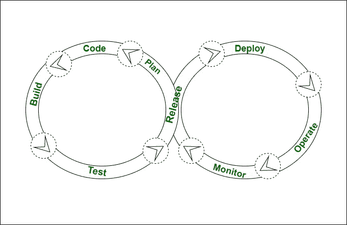

# devo PS 的生命周期

> 原文:[https://www.geeksforgeeks.org/lifecycle-of-devops/](https://www.geeksforgeeks.org/lifecycle-of-devops/)

**DevOps 生命周期**是一组阶段，包括在 [DevOps](https://www.geeksforgeeks.org/most-popular-devops-tools/) 中，参与开发和运营小组的职责，以更快地交付软件程序。DevOps 遵循积极的技术，包括编码、构建、测试、发布、部署、操作、展示和计划。

**DevOps 生命周期**遵循一系列阶段，如不停的开发、不停的集成、不停的测试、不停的监控和不停的反馈。DevOps 生命周期的每个部分都与一些设备和应用科学相关，以获得流程。一些经常使用的设备是开源的，并且主要基于商业企业的需求。DevOps 的生命周期易于操作，有助于令人满意的交付。

**DevOps 的生命周期:**
下图显示了 DevOps 生命周期的结构。

1.  **Code –**
    Coding is the first step in the development of DevOps. In this step, the developers and coders write the code on any platform to develop the product for a customer.
2.  **Build –**
    The 2nd step is to construct the model, in which the simple model of the product has constructed the use of an appropriate programming language.
3.  **Test –**
    The third step is to test or to check where the constructed merchandise and other products are going to examine with the use of the automation checking out equipment such as Bugzilla and selenium web driver.
4.  **发布–**
    这一步包括在一个独一无二的环境中规划、调度和控制所构建的方法。

*   **Deploy –**
    The step after the release phase will be Deployment where all the products, files and documents which are to deployed are carried out on the server.*   **Operate –**
    After the deployment phase i.e. after the deployment of the product or application, it is delivered to the client for use where he makes use of that product or software for everyday lifestyles purposes.*   **Monitor –**
    In this step, the delivered merchandise or software to a client has been monitored to observe down any up-time and down-time failures or if any errors are there or not.*   **Plan –**
    The last phase is Planning. After monitoring it gathers all the information, data, feedback and comments from the client and plans the modifications that need to be performed to make it better.