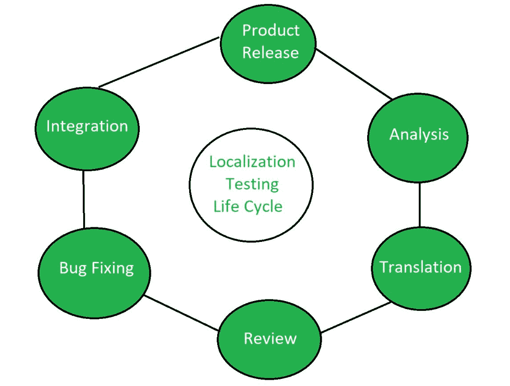

# 本地化测试

> 原文:[https://www.geeksforgeeks.org/localization-testing/](https://www.geeksforgeeks.org/localization-testing/)

**本地化测试**是一种[软件测试](https://www.geeksforgeeks.org/software-testing-basics/)，用于验证特定文化或地区的产品质量。本地化测试仅在产品的本地版本上执行。

本地化测试确保应用程序能够在特定区域使用。它只测试特定国家的用户界面、语言词汇、货币格式、日期和时间格式。

比如 [QQ](https://www.qq.com/) 就是专门为中国人设计的社交媒体平台。它以一种特定的方式支持汉语和其他方面。

**本地化测试的特点:**

*   **本地化用户界面:**
    测试用户界面是否受本地影响。按照顺序，可以说用户界面的设计是为了让特定的人感到舒适。
*   **本地化内容:**
    应用程序内置的不同内容是根据当地文化进行的，进行测试是为了检查本地人是否感到舒适。
*   **特定语言:**
    测试用于检查应用程序支持的语言，以了解软件与特定地区语言的兼容性。
*   **硬件兼容性:**
    进行硬件兼容性测试，测试软件和硬件对特定区域的兼容性。

**本地化测试流程:**

*   **设置测试环境:**
    首先设置测试环境是为了执行良好的质量测试流程。这有助于获得高质量的软件测试过程。
*   **选择产品:**
    选择将要进行本地化测试的产品。这导致测试面向产品。
*   **生成剧本:**
    剧本根据当地和特定的文化生成剧本。例如，对于美国特定的应用程序，语言设置为英语。
*   **对比:**
    现在把内置属性和本地属性进行对比，检查软件的质量。例如，将用户界面或语言与特定区域的对应关系进行比较。
*   **分析及结果:**
    对比测试过程后分析是否成功。此外，关于应用程序的不同方面，结果被提交给开发团队。

**本地化测试生命周期:**

**本地化测试的优势:**

*   本地化测试降低了整体测试成本。
*   本地化测试降低了总体支持成本。
*   它有助于减少测试时间。
*   本地化测试具有更大的灵活性和可扩展性。

**本地化测试的缺点:**

*   本地化测试需要本地专家来执行。
*   有本地翻译很贵。
*   对于测试人员来说，可能会有时间表上的挑战。