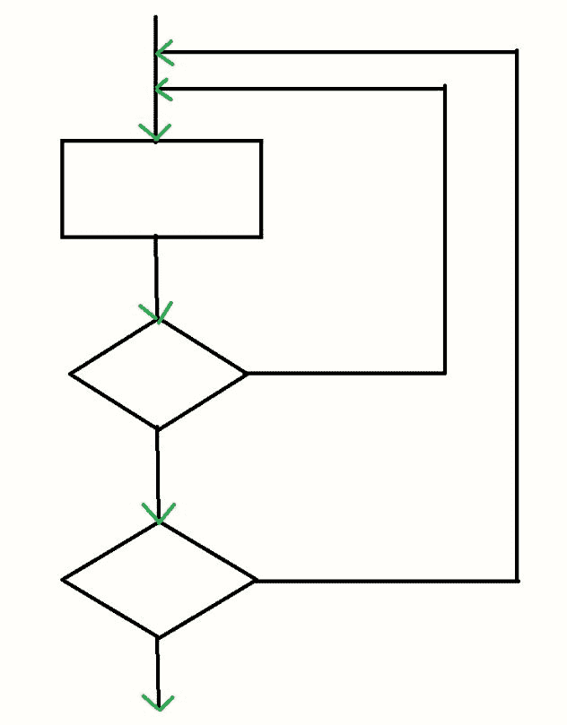
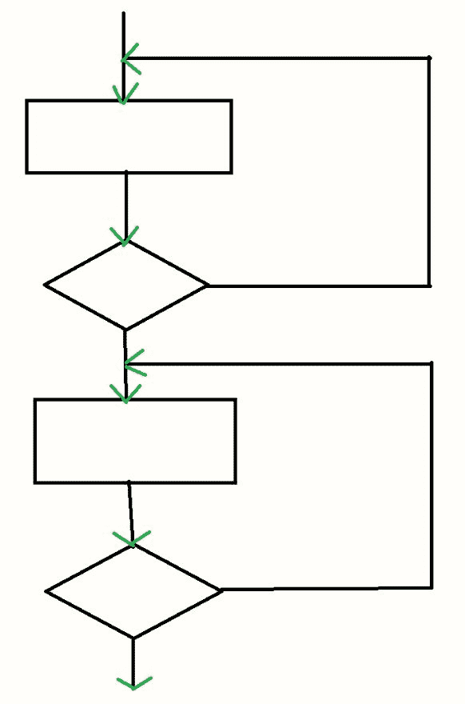
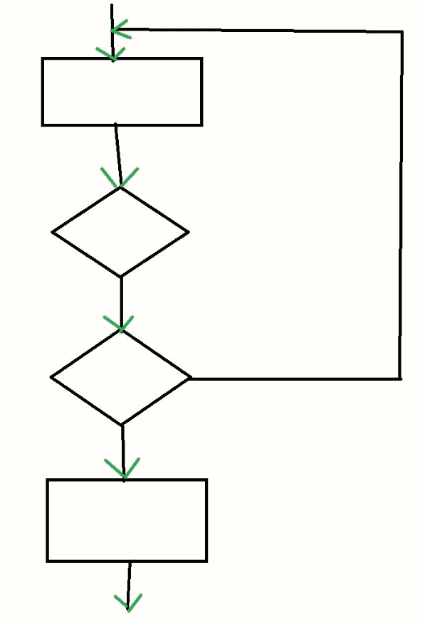

# 循环软件测试

> 原文:[https://www.geeksforgeeks.org/loop-software-testing/](https://www.geeksforgeeks.org/loop-software-testing/)

**循环测试**是一种[软件测试](https://www.geeksforgeeks.org/software-testing-basics/)类型，用于验证循环。它是控制结构测试的一种。循环测试是一种白盒测试技术，用于测试程序中的循环。

**循环测试的目标:**
循环测试的目标是:

*   修复无限循环重复问题。
*   了解表演。
*   识别循环初始化问题。
*   确定未初始化的变量。

**循环测试的类型:**
循环测试根据循环的类型进行分类:

1.  **简单循环测试:**
    在简单循环中执行的测试称为简单循环测试。简单循环基本上是一个正常的“for”、“while”或“do-while”，其中给出了一个条件，循环根据条件的真和假分别运行和终止。执行这种类型的测试基本上是为了测试循环的条件是否足以在某个时间点后终止循环。

**示例:**

```
while(condition)
  {
   statement(s);
  } 
```


*   **Nested Loop Testing:**
    Testing performed in a nested loop in known as Nested loop testing. Nested loop is basically one loop inside the another loop. In nested loop there can be finite number of loops inside a loop and there a nest is made. It may be either of any of three loops i.e., for, while or do-while.

    **示例:**

    ```
    while(condition 1)
      {
       while(condition 2)
        {
         statement(s);
        }
      } 
    ```

    

    *   **Concatenated Loop Testing:**
    Testing performed in a concatenated loop is known as Concatenated loop testing. It is performed on the concatenated loops. Concatenated loops are loops after the loop. It is a series of loops. Difference between nested and concatenated is that in nested loop is inside the loop but here loop is after the loop.

    **示例:**

    ```
    while(condition 1)
      {
       statement(s);
      }
     while(condition 2)
     {
      statement(s);
     } 
    ```

    

    *   **Unstructured Loop Testing:**
    Testing performed in an unstructured loop is known as Unstructured loop testing. Unstructured loop is the combination of nested and concatenated loops. It is basically a group of loops that are in no order.

    **示例:**

    ```
    while()
      {
       for()
        {}
       while()
        {}
      } 
    ```

    

    **循环测试的优势:**
    循环测试的优势有:

    *   循环测试限制了循环的迭代次数。
    *   循环测试确保程序不会进入无限循环过程。
    *   循环测试持续循环中每个使用的变量的初始化。
    *   循环测试有助于识别循环中的不同问题。
    *   回路测试有助于确定容量。

    **循环测试的缺点:**
    循环测试的缺点是:

    *   循环测试在低级软件的错误检测中最有效。
    *   循环测试在错误检测中没有用。