# 数学|超几何分布模型

> 原文:[https://www . geesforgeks . org/数学-超几何-分布-模型/](https://www.geeksforgeeks.org/mathematics-hypergeometric-distribution-model/)

超几何分布模型用于根据超几何分布估计在测试或调试过程开始时程序中最初存在的故障数量。假设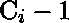是到目前为止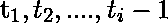已经检测到的累计错误数，假设是到时间新检测到的错误数。

**假设:**

1.  当测试阶段开始时，一个程序最初包含 m 个错误。
2.  测试被定义为由输入数据和输出数据组成的多个测试实例。换句话说，一天或一周内执行的测试操作的集合称为测试实例。对于 i = 1，2，.，测试实例由表示。。。，n。
3.  检测到的故障不会在测试实例之间移除。

因此，根据后一种假设，在几个测试实例中可能会遇到相同的故障。设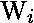为测试实例经历的故障数。需要注意的是，一些故障可能是那些已经在中计数的故障，剩余的 Wi 故障是新检测到的故障。
如果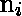是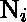的观察实例，那么我们可以看到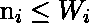。每个故障可以分为两类:

1.  新发现的断层
2.  重新发现的错误

如果我们假设新检测到的故障数量遵循超几何分布，那么在故障中准确获得新检测到的故障的概率为:

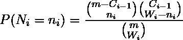

在哪里

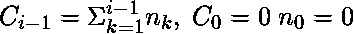

和

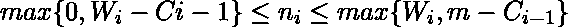

因为假设是超几何分布的，所以在间隔![$[t_{i-1}, t_i]$](img/d2856af15da08543af3eca6bcecc8883.png "Rendered by QuickLaTeX.com")期间新检测到的故障的预期数量是，

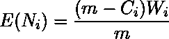

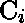的期望值由下式给出:

![$E(C_i)=m\left [1- \prod_{j=1}^i (1-p_i)  \right ]$](img/3956a759717b631c55f5af4a017c8b69.png "Rendered by QuickLaTeX.com")

在哪里

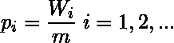