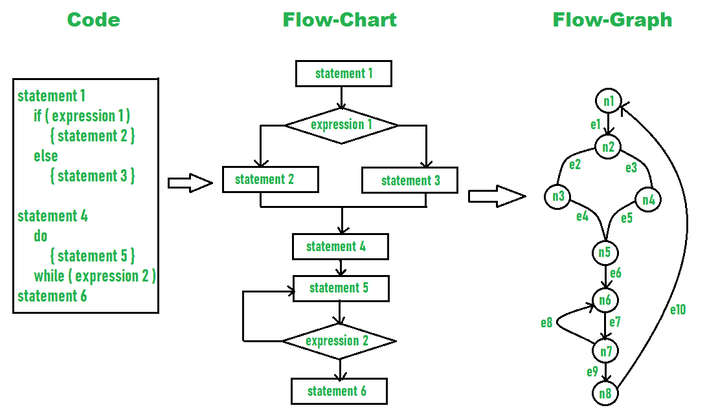

# 产品设计模型的度量标准

> 原文:[https://www . geesforgeks . org/产品设计模型指标/](https://www.geeksforgeeks.org/metrics-for-the-design-model-of-the-product/)

**度量**简单地度量量化评估，该评估关注最常用于比较和跟踪系统性能的可数值。度量用于不同的场景，如分析模型、设计模型、源代码、测试和维护。设计建模的度量标准允许开发人员或软件工程师评估或评估设计质量，并包括各种体系结构和组件级设计。

**Glass and Card 提供的指标:**
在设计产品时，对复杂性进行高效管理非常重要。复杂性本身意味着非常难以理解。我们知道系统通常是复杂的，因为它们有许多相互关联的组件，这使得理解起来很困难。格拉斯和卡德是两位科学家，他们提出了三种设计复杂性度量标准。这些内容如下:

1.  **Structural Complexity –**
    Structural complexity depends upon fan-out for modules. It can be defined as :

    ```
    S(k) = f2out(k)
    ```

    其中 **f <sub>out</sub>** 表示模块 k 的扇出(扇出表示从属于模块 k 的模块数量)。

2.  **Data Complexity –**
    Data complexity is complexity within interface of internal module. It is size and intricacy of data. For some module k, it can be defined as :

    ```
    D(k) = tot_var(k) / [fout(k)+1]
    ```

    其中 *tot_var* 是进出模块的输入和输出变量的总数。

3.  **System Complexity –**
    System complexity is combination of structural and data complexity. It can be denoted as:

    ```
    Sy(k) = S(k)+D(k)
    ```

    当结构、数据和系统复杂性增加时，整体架构复杂性也会增加。

**复杂性度量–**
复杂性度量用于衡量整个软件的复杂性。复杂性度量的计算可以在流程图的帮助下完成。它有时被称为圈复杂度。圈复杂度是表示软件系统复杂度的一个有用的度量。如果不使用复杂性度量，在设计风险成本来源的产品时，确定复杂性是非常困难和耗时的。即使是持续的复杂性分析也使得项目团队和管理层很难解决问题。测量软件复杂性可以提高代码质量、提高生产率、满足架构标准、降低总体成本、增强健壮性等。为了计算圈复杂度，使用以下等式:

```
Cyclomatic complexity= E - N + 2 
```

其中，E 是边的总数，N 是节点的总数。

**示例–**
在下图中，可以看到边数和节点数。



因此，圈复杂度可以计算为–

```
Given,
E = 10, 
N = 8

So,
Cyclomatic complexity 
= E - N + 2 
= 10 – 8 + 2
= 4 
```