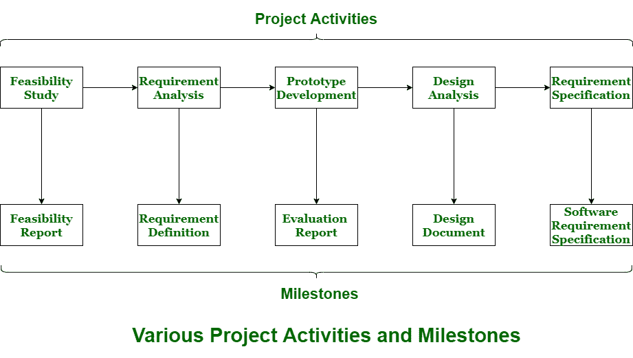

# 项目规划活动中的里程碑和可交付成果

> 原文:[https://www . geesforgeks . org/里程碑和可交付项目规划活动/](https://www.geeksforgeeks.org/milestones-and-deliverable-in-project-planning-activities/)

**项目规划**简单来说就是规划如何在给定的时间段内建立并完成项目。它包括指定资源的项目目标所需的已定义阶段。对于业务发展来说，这是一项非常重要的任务，因为它有助于确定预期目标，降低风险，并最终交付满足客户需求的产品。

项目经理应该提前认识到未来可能出现的问题，并准备好解决这些问题的方案。应根据收集到的所有必要信息提前准备项目计划。项目规划过程是迭代的，因为新信息在项目开发的每个阶段都是可用的。因此，计划需要定期修改，以适应项目的新要求。

1.  **Milestone :**
    When project begins then it is expected that project related activities must be initiated. In project planning, series of milestones must be established. Milestone can be defined as recognizable endpoint of software project activity. At each milestone, report must be generated.

    里程碑是项目的独特和合乎逻辑的阶段。它用作项目开始和结束日期、外部评审或输入需求、检查预算、提交可交付成果等的信号站。它只是表示事件的清晰顺序，这些事件是递增开发或构建的，直到项目成功完成。它通常被称为零持续时间的任务，因为它们被用来象征项目中的成就或时间点。它有助于表示发展的变化或阶段。

2.  **Deliverable :**
    It simply means result or software product, designed document, or asset of project plan that can be submitted to customers, clients, or end-users. A deliverable should be completed in all aspects.

    它是项目或项目过程范围内的输出元素。交付物有一个到期日，是真实的、可触摸的、可测量的。交付成果只是提供给客户或客户，并满足里程碑或到期日，这通常是在项目规划过程中创建和产生的。可交付成果通常是里程碑，但里程碑不一定是可交付成果。

