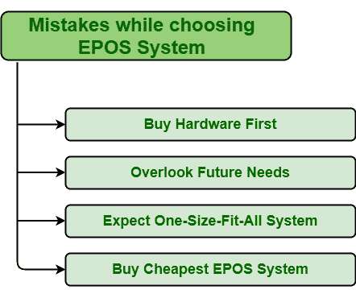

# 购买 EPOS 系统应避免的错误

> 原文:[https://www . geeksforgeeks . org/购买 epos 系统时要避免的错误/](https://www.geeksforgeeks.org/mistakes-to-avoid-while-buying-epos-system/)

EPOS 系统(电子销售点)，顾名思义，就是专门为商家设计的电子系统，可以在最短的时间内增加销售额，增加利润，增加控制，处理信息。EPOS 系统由硬件和软件组成，其中软件用于存储和通信数据，而硬件被认为是用于控制 EPOS 事务的物理工具。

它记录实时信息，帮助人们做出更好的决策，并允许更快的交易和减少错误。EPOS 基本上被认为是一个系统的核心组成部分，它允许人们更有效地管理业务，从而增加利润。因此，在为他们的业务选择 EPOS 系统时需要非常小心，并应避免以下常见错误。

1.  **先买硬件–**
    EPOS 系统由硬件和软件两部分组成，两者同等重要。EPOS 系统有不同的类型，每个 EPOS 系统都需要特定的操作系统和硬件，如打印机、读卡器等。但人们在购买 EPOS 时往往会忽略这一点，先找硬件。人们应该记住，没有软件，硬件是无用的，并且不是所有的软件都与特定的硬件集成在一起。因此，与其先在硬件上浪费时间和金钱，不如寻找他们想要使用的软件，然后选择与所选软件完全兼容的 EPOS 硬件。
2.  **忽视未来需求–**
    每个人都想长期保存数据，因此需要一个 EPOS 系统，这样他们就可以长期拥有信息。EPOS 是一个电子系统，可以加快库存管理、销售业绩、会计核算、数据处理等各种业务流程，记录海量准确的数据等。人们习惯了这样的制度，想长期保持下去。但是人们往往会忽略长期目标，只关注眼前的问题。因此，在购买 EPOS 系统时，应该牢记他们的长期要求，而不是解决当前的问题。
3.  **期待一刀切系统–**
    显然，一个 EPOS 系统不可能适合所有业务类型。每个企业都有不同的目标、目的、要求，因此现在有不同类型的 EPOS 系统，如美容院 EPOS 系统、时尚 EPOS 系统、酒店 EPOS 系统等。但是有些人倾向于忽略这一点。他们希望一个系统能够适应所有类型的业务，而这是不可能的。是的，要找到一个能够 100%满足您的业务需求的 EPOS 系统并不容易，但是可以选择一个能够满足 90 %以上需求的 EPOS 系统，并为其余部分进行定制。
4.  **买最便宜的 EPOS 系统–**
    是的，每个人都想尽可能以最低的价格买东西，如果一个人以最便宜的价格买到了所需的东西，那就没有错了。以最便宜的价格买到的东西没有必要毫无问题地有效运作。市面上有很多价格最便宜的 EPOS 硬件和软件，人们都陷入其中。他们只是忽略与最便宜的系统相关的风险，然后购买它。但结果可能是最糟糕的。他们最终修复了最便宜的 EPOS 系统造成的损害，其成本高于最初购买它的投资。因此，在购买任何东西之前，应该优先考虑他们的需求，并检查他们的预算。之后按照预算去购买 EPOS 系统。