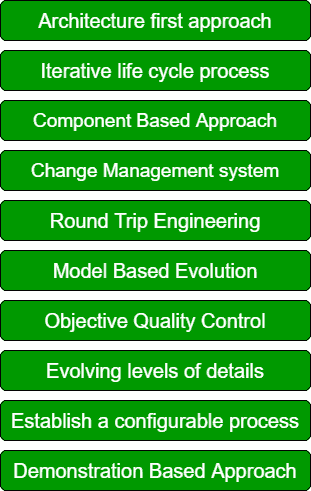

# 软件开发的现代原则

> 原文:[https://www . geesforgeks . org/modern-软件开发原理/](https://www.geeksforgeeks.org/modern-principles-of-software-development/)

软件开发有一些现代原则。通过遵循这些现代原则，我们可以开发出满足客户所有需求的有效软件。要开发一个合适的软件，应该遵循以下 10 个软件开发原则:

**软件开发原则:**

这些解释如下。

1.  **Architecture first approach:**
    In this approach over the main aim is to build a strong architecture for our software. All the ambiguities and flaws are being identified during the very trivial phase. Also, we can take all the decisions regarding the design of the software which will enhance the productivity of our software.
2.  **Iterative life cycle process:**
    An iterative life cycle process we repeated the process again and again to eliminate the risk factors. An iterative life cycle we mainly have four steps requirement gathering, design, implementation, and testing. All these steps are repeated again and again until we mitigate the risk factor. Iterative life cycle process is important to alleviate risk at an early stage by repeating the above-mentioned steps again and again.
3.  **Component Based Approach:**
    In component-based approach is a widely used and successful approach in which we reuse the previously defined functions for the software development. We reuse the part of code in the form of components. Component-based UI Development Optimizes the Requirements & Design Process and thus is one of the important modern software principle.
4.  **Change Management system:**
    Change Management is the process responsible for managing all changes. The main aim of change management is to improve the quality of software by performing necessary changes. All changes implemented are then tested and certified.

5.  **Round Trip Engineering:**
    In round trip engineering code generation and reverse engineering take place at the same time in a dynamic environment. Both components are integrated so that developers can easily work on both of them. In round trip engineering, the main characteristic is automatic update of artifacts.
6.  **Model Based Evolution:**
    Model-based evolution is an important principle of software development. A model-based approach supports the evolution of graphics and textual notions.
7.  **Objective Quality Control:**
    The objective of quality control is to improve the quality of our software. It involves Quality management plan, Quality metrics, Quality checklist, Quality baseline, and Quality Improvement measures.
8.  **Evolving levels of details:**
    Plan intermediate releases in groups of usage scenarios with evolving levels of details. We must plan an incremental realize in which we have an evolving level of use case, architecture, and details.
9.  **Establish a configurable process:**
    Establish a configurable process that is economically scalable. One single process is not suitable for all the development so we must use a configurable process which can deal with various applications.
10.  **基于演示的方法:**
    在这种方法中，我们主要关注演示。它通过对问题领域、使用的方法和解决方案进行清晰的描述，有助于提高我们软件的生产率和质量。