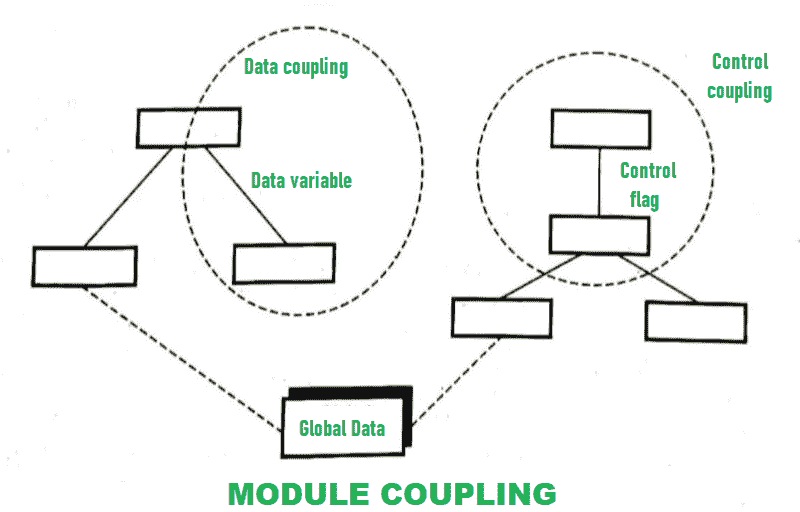

# 模块联轴器及其类型

> 原文:[https://www . geesforgeks . org/module-coupling-and-its-type/](https://www.geeksforgeeks.org/module-coupling-and-its-types/)

先决条件–[耦合与凝聚](https://www.geeksforgeeks.org/software-engineering-coupling-and-cohesion/)
**耦合**简单来说就是将两个或多个事物连接在一起。它意味着两件事的配对。它实际上衡量了两个事物之间的独立程度，以及两个事物之间的联系有多紧密或代表了它们之间关系的强度。

**模块耦合**是指两个或两个以上的模块之间以及与外界的耦合。它通常表示模块如何与另一个模块和外部世界连接。耦合与凝聚力有关。内聚意味着内聚模块在整个软件过程中只执行一项任务或一件事，与其他模块有少量的交互。在内聚的帮助下，可以进行数据隐藏。低耦合与高内聚相关，高耦合与低内聚相关。耦合度越低，内聚度越高，程序越好，这些程序可以说在功能上独立于其他模块。

低耦合最小化*“涟漪效应(传播任何动作、错误或故障的结果)”*，这意味着它减少了一个模块中的变化导致其他模块中的错误的影响。模块耦合的主要目的或目标是在软件设计中努力实现或获得模块之间尽可能低的耦合。如果这种耦合减少了涟漪效应、程序更改、测试和维护的成本，那么它就说得很好。

**耦合类型:**
以下是耦合类型–

1.  **数据耦合–**
    数据耦合简单来说就是数据的耦合，即数据通过参数传递时或者模块通过参数共享数据时数据之间的交互。当一个模块的数据与其他模块共享或传递给其他模块时，这种情况称为数据耦合。
2.  **控制耦合–**
    控制耦合简单来说就是控制模块之间的数据共享。如果模块通过共享受控数据进行交互或连接，则称它们是控制耦合的。受控耦合意味着一个模块通过其他模块控制数据或信息的流动，通过它们控制关于做什么的信息。
3.  **公共耦合–**
    公共耦合简单来说就是几个模块之间共享公共数据或者全局数据。如果两个模块通过全局数据项共享信息或者通过共享公共数据进行交互，那么它们被称为是共同耦合的。
4.  **内容耦合–**
    内容耦合简单来说就是利用一个模块在其他模块中维护的数据或控制信息。这种耦合也称为病理耦合。在这些耦合中，一个模块依赖于另一个模块的内部工作。因此，如果在模块的内部工作中必须进行任何更改，那么这将导致需要对相关模块进行更改。
5.  **Stamp Coupling–**
    Stamp Coupling 简单来说就是模块之间共享复合数据结构。如果模块通过共享或日常结构进行交互或通信，该结构包含的信息比执行其动作所需的信息多，则这些模块被称为是戳耦合的。
6.  **外部耦合–**
    外部耦合是指模块之间外部强加的数据结构或格式的共享。外部耦合非常重要，但也应该有一个限度。它应该被限制在较少数量的具有结构的模块。