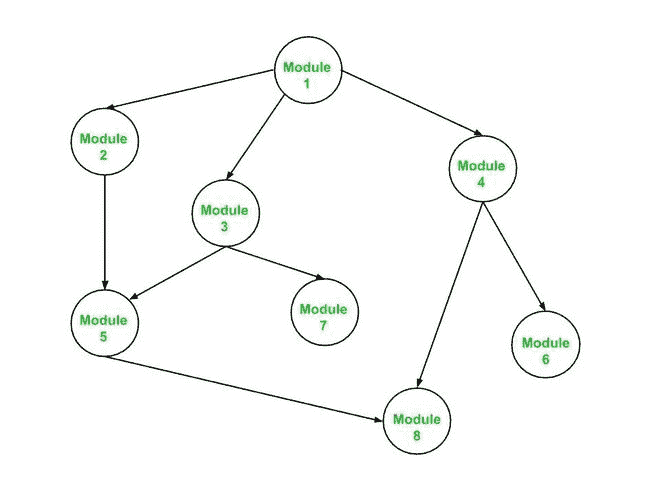
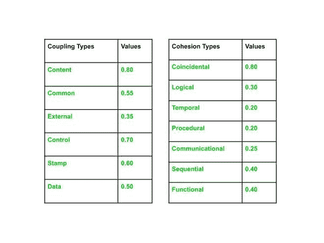
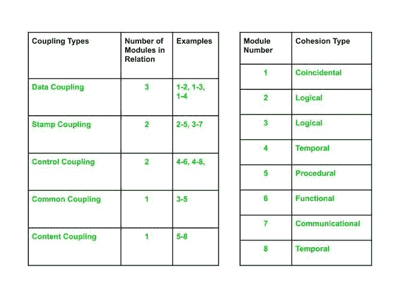
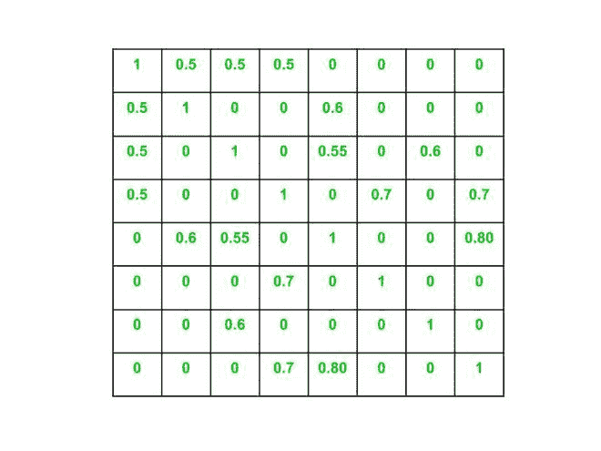
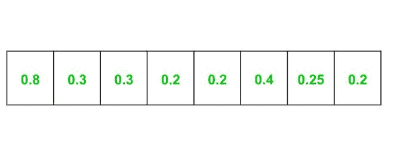

# 基于模块耦合切片的测试用例优先级

> 原文:[https://www . geesforgeks . org/module-coupling-slice-based-test-case-priorization/](https://www.geeksforgeeks.org/module-coupling-slice-based-test-case-prioritization/)

基于模块耦合切片的测试用例优先化是一种技术，它使用模块耦合值来识别软件中的关键模块，从而基于这些关键模块对测试套件中的测试用例进行优先化。

因为大多数测试用例优先化技术没有考虑到一个模块中的变化也可能在软件的其他模块中传播的事实。因此，不要根据简单的标准，比如覆盖率、风险、需求等来确定测试用例的优先级。关键模块可以基于哪个测试用例优先被执行来识别。下面是用于执行基于模块耦合切片的测试用例优先级排序的算法:

#### 基于模块耦合切片的测试用例优先排序算法

1.  首先，我们创建一个**模块耦合矩阵** **C** ，表示程序中所有模块之间的耦合。构造一个 *m* X *m* 模块耦合矩阵，其中 *m* 为程序中的模块数。使用模块耦合值填充矩阵，即 C <sub>ij</sub> 代表模块 *i* 和模块 *j* 之间的耦合。模块耦合矩阵本质上是对称的，即 C <sub>ij</sub> = C <sub>ji、</sub>，所有对角元素即 C <sub>ii</sub> 对所有 *i* 等于 1。
2.  利用每个模块的内聚类型和每个内聚类型对应的值，构造一个**模块内聚矩阵 S** 。这是一个 1 X *m* 矩阵，其中 *m* 是程序中的模块数。
3.  最后一步是创建一个**模块依赖矩阵 D，**是一个 *m* X *m* 矩阵，其中 *m* 是程序中的模块数量。它使用以下等式构建:

```
Dij = 0.15 * ( Si + Sj ) + 0.7 * Cij

where, Cij is not equal to 0
Also, 
Dij = 0 where Cij = 0
Dii = 1 for all i

```

我们可以看到，模块耦合矩阵 C 和模块内聚矩阵 S 被用来构造模块依赖矩阵 d。在模块依赖矩阵中具有最高值的链接被赋予最高优先级，并且测试用例被优先用于与那些链接相关联的相同模块。

#### 已解决的示例

**问题**:使用以下调用图和表，构建模块耦合、模块内聚和模块依赖矩阵:

  

**解决方案**:

使用上述算法，我们可以如下计算矩阵:

**1。模块耦合矩阵(C)**

创建一个 *m x m* 矩阵，其中 *m* 是模块的数量。这里，从给定的调用图中，我们可以看到有八个模块，因此 *m* 的值= 8。因此，创建一个 8 x 8 矩阵，并根据与模块 *i* 和 *j* 之间的耦合类型相关的值开始填充它。

```
Example 1: 

For the link 1-2 in call graph,
the coupling type = Data Coupling (Refer given table in the Question)
i = 1 and j = 2
C12  =  0.50 since value associated with Data Coupling Type is 0.50

Example 2:

For the link 3-7 in call graph,
the coupling type = Stamp Coupling (Refer given table in the Question)
i = 3 and j = 7
C37 = 0.60 since value associated with Stamp Coupling Type is 0.60

```

以类似的方式填充整个矩阵，完整的模块耦合矩阵如下所示:



**2。模块内聚矩阵**

这是一个 1 x *m* 矩阵，使用问题中提供的表格创建起来很简单。使用模块内聚类型和与内聚类型相关联的值来填充这个矩阵。

```
Example 1: 

For the module 1 in call graph,
the cohesion type = Coincidental (Refer given table in the Question)
S1 = 0.80 since value associated with Coincidental Cohesion Type is 0.80

Example 2: 

For the module 4 in call graph,
the cohesion type = Temporal (Refer given table in the Question)
S4 = 0.20 since value associated with Temporal Cohesion Type is 0.20

```

如上所述填写整个内聚矩阵，完整的模块内聚矩阵将是:



**3。模块依赖矩阵(D)**

它是一个 *m* X *m* 矩阵，使用模块耦合和模块内聚矩阵构建。使用算法中规定的公式。

```
Example 1: 
For the link 1-2 in call graph,
D12 = 0.15 * ( S1 + S2 ) + 0.7 * C12
Since S1 = 0.80, S2 = 0.30 and C12 = 0.50
Therefore, 
D12 = 0.15 * ( 0.80 + 0.30 ) + 0.7 * 0.50
    = 0.515 = 0.52 (round off to 2 decimal places)

Example 2: 
For the link 4-6 in call graph,
D46 = 0.15 * ( S4 + S6 ) + 0.7 * C46
Since S4 = 0.20, S6 = 0.40 and C46 = 0.70
Therefore, 
D46 = 0.15 * ( 0.20 + 0.40 ) + 0.7 * 0.70
    = 0.58

```

填充整个矩阵后，模块依赖矩阵将为:


从上面显示的模块依赖矩阵中，我们可以看到模块 4、5、6 和 8 在获得的依赖矩阵中具有最高值，因此与其他模块相比，这些模块的测试用例应该被赋予更高的优先级。