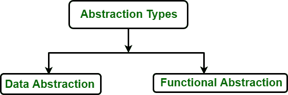

# 软件工程中的模块规范

> 原文:[https://www . geesforgeks . org/module-规格-in-software-engineering/](https://www.geeksforgeeks.org/module-specifications-in-software-engineering/)

系统设计是模块化的，模块支持明确定义的抽象。抽象概念在软件设计中被广泛使用。有两种类型的抽象，如下图所示:

**数据抽象:**
在数据抽象中，思想是隐藏关于数据的信息以及数据在程序中是如何表现的。复合数据的类似概念叫做数据抽象。数据抽象可能是一种方法，它允许我们将如何使用复合数据对象与如何从更原始的数据对象构建复合数据对象的小细节隔离开来。通过该特性，可以创建用户定义的数据类型，从而增强[编程语言](https://www.geeksforgeeks.org/introduction-to-programming-languages/)的功能。

数据抽象背后的主要思想是明确区分数据类型的属性和相关细节。实现这种分离是为了使抽象数据类型的属性对接口可见，而实现细节被隐藏。数据抽象是将数据提炼为其本质形式的过程。抽象数据类型被定义为根据其支持的操作而不是根据其结构或实现来定义的知识类型。

**功能抽象:**
在功能抽象中，完成模块的算法细节对于功能的用户是不可见的。模块的用户只需要知道正确的调用约定。用户可以调用一个模块，而不必了解它是如何实现的。

**例如:**
一个模块计算一个值的日志可以用模块日志来表示。用户只需要知道模块的接口。

模块规范规定了模块应该做什么。

*   主要目标是提供足够精确和完整的规范，使得其他软件可以在没有额外信息的情况下与指定的软件进行交互。
*   第二个目标是在规范中不再包含满足第一个目标所需的信息。

模块规格应具有的理想属性如下:

*   **完成–**
    给定的规范应该指定模块的整个行为，以便只有正确的实现满足规范。规范必须向预期用户提供正确使用程序所需的所有信息。规范必须向实现者提供他完成程序所需的关于预期用途的所有信息。
*   **不含糊–**
    给定的规格应该不含糊。规范应该有多个解释。
*   **可以理解–**
    给定的规格应该可以理解。具体的语言应该是这样的，规范可以很容易地编写。
*   **独立于实现–**
    它是规范的一个重要属性。规范应该以独立于模块实现的抽象方式给出，并且不应该为模块的实现指定任何特定的方法。规范应该只给出外部行为；模块的内部细节应由程序员稍后决定。