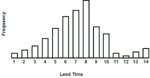
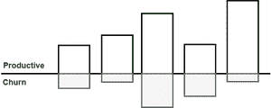
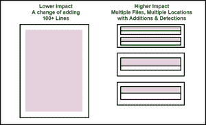

# 软件工程中最重要的人员指标

> 原文:[https://www . geesforgeks . org/最重要的人-软件工程中的指标/](https://www.geeksforgeeks.org/most-important-people-metrics-in-software-engineering/)

根据软件开发人员的观点，各种度量对所有的软件管理者来说都是非常重要的。以下是各种软件开发人员指标:

1.  铅
2.  搅拌
3.  影响
4.  活动天数
5.  效率

这五个度量的推导用于版本控制数据。从这些现代代码库中获得的元数据有助于提供对工程工作模式的实时洞察，也有助于团队的健康。

**1。交付周期:**
交付周期是从项目开发开始到交付给客户或完成之间的时间。任何提前期的历史都肯定会帮助开发人员，当一个项目将准备好与高度的准确性。如果您的开发团队没有定期提供估计，提前期数据也很有用，因为对项目交付给客户的预测也是基于类似项目的提前期。

**提前期说明**

**2。代码流失率:**
代码流失率是开发人员自己的代码所占的百分比，代表对他们自己最近工作的编辑。基本上是需要在短时间内(如几周)修改、添加和删除的代码行。这样做的主要目的是帮助软件经理和其他项目涉众控制项目的开发过程，特别是考虑其质量。

**代码搅动**

**3。影响:**
影响可以定义为；它是对项目内代码变更产生的影响，也是考虑实现代码变更的开发人员的认知负荷的一种方式。设定为项目的变更越困难，产生的影响分数就越高。

**变更集的影响取决于多种因素，如下所示:**

*   变更中的代码量；
*   这些变化的严重性；
*   受更改影响的文件数。

**冲击**

**4。活跃日:**
工程师向项目提交代码的那一天称为活跃日。工程师在一个活跃的日子里所做的任务包括写代码和检查代码。工程师在构建和解决困难的概念问题方面有独特的技能，所以贡献代码是工程师能做的最重要的事情之一。非工程任务，如计划、会议和追踪规范是不可避免的。

**5。效率:**
效率是工程师贡献的代码中有生产力的百分比的度量，通常包括平衡代码输出和代码寿命。效率与编写的代码量无关。效率越高，代码提供业务价值的时间就越长。

**人的优势度:**

*   它帮助人们说执行团队的语言。
*   公共部门机构在使用人员指标和收集数据方面处于不同阶段。
*   各部门和机构也有不同的工具和人员信息系统来收集和整合数据。