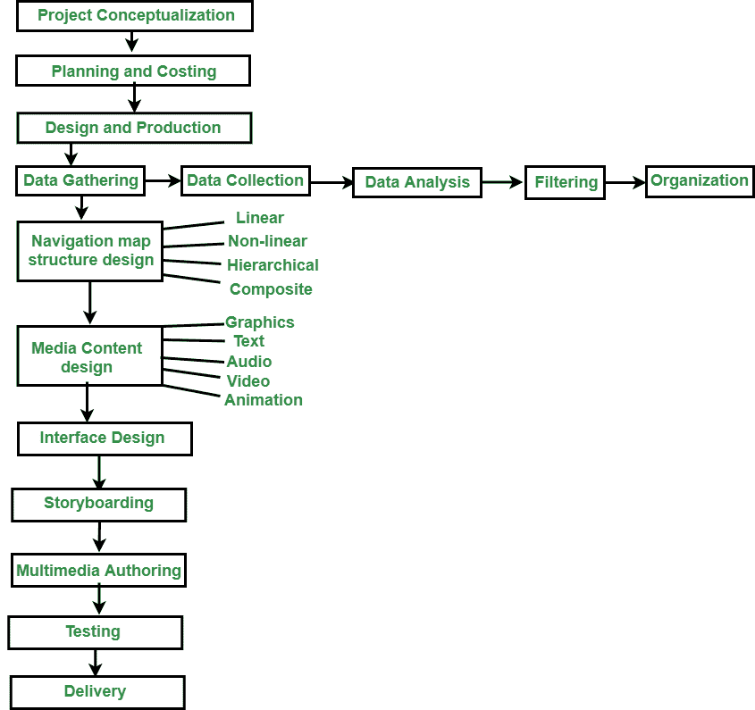

# 多媒体项目及其阶段

> 原文:[https://www . geesforgeks . org/多媒体-项目及其阶段/](https://www.geeksforgeeks.org/multimedia-projects-and-its-stages/)

多媒体项目是一个经典的软件项目，它是使用多媒体技术开发的，其特定目的是以一种娱乐和引人注目的方式分发信息。多媒体项目需要创造力、艺术以及编程技能。在开发多媒体应用程序时，专业人员必须选择硬件和软件设备及组件。有多种软件工具可供选择。像所有其他项目一样，多媒体项目也是分阶段开发的。

多媒体应用开发的阶段

**以下是多媒体项目开发的基本阶段。**

*   项目概念化
*   规划和成本计算
*   设计和生产
*   测试
*   交货

**项目概念化:**

每个项目都是从一个概念开始的。多媒体项目概念实际上是项目的定义。为了定义项目，开发团队和客户需要召开各种会议和讨论来确定实际问题。它可能是现有的升级版，也可能是全新的。它必须满足客户的现有要求。

**计划和成本计算:**

在这一阶段，对想法的分析已经完成，将被转化为一个多媒体项目。这个想法可以通过概述其信息和目标来进一步完善。在开始开发多媒体项目之前，有必要计划需要哪些写作技能、图形艺术、音乐、视频和其他多媒体技能。还需要估计准备多媒体的所有元素所需的时间，并相应地准备预算。在编制预算后，可以开发概念的原型。

**设计生产:**

一旦项目被开发，费力的项目开发周期就开始了。在此阶段下，将执行各个子阶段。

*   数据采集
*   导航地图结构设计
*   媒体内容设计
*   界面设计
*   记事板制作
*   集成(多媒体创作)

**测试:**

在每个项目中，测试阶段确保产品没有错误。除了消除 bug，测试的另一个方面是确保多媒体应用程序满足项目的目标。还需要测试多媒体项目是否在计划的交付平台上正常工作，是否满足客户的需求。

**交货:**

多媒体应用程序开发的最后阶段是打包项目并将完整的项目交付给最终用户。这个阶段有几个步骤，例如:

*   实施，
*   维护，
*   运输和营销