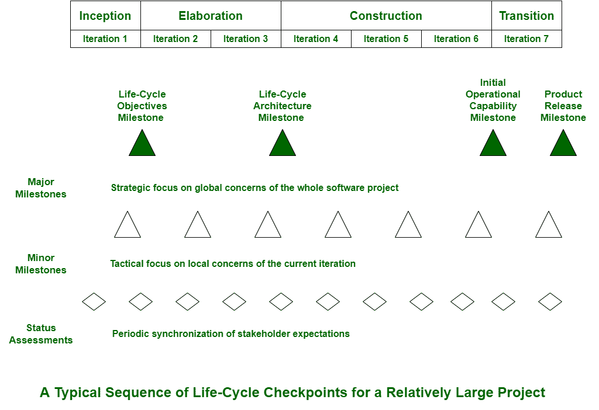

# 流程检查点注意事项

> 原文:[https://www . geesforgeks . org/进程检查点说明/](https://www.geeksforgeeks.org/note-on-checkpoints-of-the-process/)

在软件开发中，所有全系统的活动都在开发的每个阶段结束时举行。这些检查点提供了生命周期中里程碑的可见性，也提供了全系统问题的可见性。这些检查点通常提供以下内容:

*   它只是同步了管理和工程的观点。
*   它还验证每个阶段的目标是否已经实现。
*   为分析和评估提供依据，以确定项目是否按计划进行，并按要求进行纠正和采取正确措施。
*   它还识别风险、问题或本质问题以及不可容忍的情况。
*   对于整个生命周期，它执行全局评估。

通常，为了在整个生命周期中同步涉众的期望，使用了三个项目检查点序列。

这三种类型的联合管理审查如下:

1.  **主要里程碑–**
    主要里程碑是在每个开发阶段结束时执行的全系统事件。这些里程碑可以用在各种过程模型中，甚至用在传统的瀑布模型中。它们通常有助于提供全系统问题的可见性。它们还有助于同步管理和工程观点。它有助于验证每个阶段的目标是否已经成功实现。它们用于在项目的当前状态下实现每个利益相关者之间的一致。这些里程碑对于确认和确保需求理解、生命周期计划以及产品的形式、功能和质量处于平衡的细节水平非常重要。这也有助于确保不同工件之间的一致性。
2.  **次要里程碑–**
    次要里程碑也称为微观里程碑。它们只是项目经理通常用来保持对每天活动控制的监控点。次要里程碑是以迭代为中心的事件，以详细的方式审查迭代的数据或内容，并授权已经继续的工作。他们通常将主要里程碑之间的经过时间划分为短时间间隔。这样做是为了让我们相信，重大里程碑将会实现。早期迭代只关注分析和设计，而后期迭代更关注完整性、一致性、可用性和变更管理。
3.  **状态评估–**
    状态评估通常提供一种机制，用于解决、沟通和解决与管理、技术和项目风险相关的问题。其主要目标是确保各方的所有期望同步一致。这样做是为了解决并检查进度和质量指标，确保持续关注项目动态。它还保持所有利益相关者之间的沟通。它还为管理层提供了对正在取得的进展的频繁和定期的洞察。

生命周期中通常有四个阶段，如初始、精化、构建和过渡。
迭代也代表各种活动的循环。生命周期的所有四个阶段都由一个或多个迭代组成。一个次要的里程碑只是获得并捕获两个工件。这两个工件是显示评估标准和计划的发布规范，以及显示结果的发布描述。在每个阶段结束时，主要里程碑使用这两个工件的非正式的、开发团队控制的版本，次要里程碑使用这两个工件的非正式的、开发团队控制的版本。