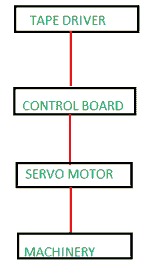
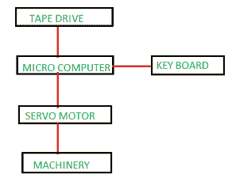

# 数控(NC)和计算机数控(CNC)

> 原文:[https://www . geesforgeks . org/numeric-control-NC-和-computer-numeric-control-CNC/](https://www.geeksforgeeks.org/numeric-control-nc-and-computer-numeric-control-cnc/)

**1。数控(NC) :**
数控是对加工刀具建立自动控制的传统方式。这个过程由数字、字母、符号控制。这里的过程由一组指令控制，这些指令被称为程序。由于它是一种传统的或幼稚的方法，所以它的计算能力较低。它成本更低，并且需要更少的维护。
*例*:

```
3D printers, boring tools 
```



**NC 的属性:**

1.  这是控制机器的传统方法。
2.  它提供的灵活性较小。
3.  指令是在穿孔卡片的帮助下给出的。
4.  为了改变功能，穿孔卡片上的信息被修改。
5.  它的计算能力较低。
6.  它不能连续运行很长时间。
7.  它是不可编程的，被认为是硬连线的。
8.  它不太贵，维护成本低。
9.  它具有高精度和更大的能力。
10.  穿孔卡片包含一套说明。

**2。计算机数字控制(CNC) :**
计算机数字控制是对机器进行控制的更好版本，机器上装有微型计算机。该程序是以字母数字代码的形式编写的。由于这是对机器控制的更好版本，它有更多的计算能力。成本更高，维护成本也更高。
*例*:

```
Lasers, mills 
```



**CNC 的属性:**

1.  这是一种新的更好的控制机器的方式。
2.  它提供了更多的灵活性。
3.  指令通过连接在计算机上的键盘给出。
4.  为了改变功能，计算机本身的程序被改变。
5.  它比数控具有更强的计算能力。
6.  它可以连续运行，甚至长达 24 小时。
7.  它是可编程的，被认为是软连线的。
8.  它很贵，需要更多的维护。
9.  精度低，容量小。
10.  该程序用字母数字代码编写，由计算机辅助设计生成。