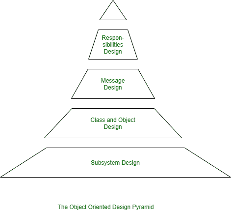

# 面向对象分析与设计

> 原文:[https://www . geesforgeks . org/面向对象分析与设计/](https://www.geeksforgeeks.org/object-oriented-analysis-and-design/)

**面向对象分析(OOA):**
面向对象分析(OOA)是作为面向对象软件工程的一部分执行的第一个技术活动。面向对象分析引入新概念来研究问题。它基于一套基本原则，如下所示-

1.  信息域被建模。
2.  表现为行为。
3.  功能描述。
4.  数据、功能和行为模型被划分以揭示更多细节。
5.  早期的模型代表了问题的本质，而后期的模型提供了实现
    细节。

上述注释原则构成了面向对象分析方法的基础。

**面向对象设计(OOD):**
使用面向对象分析创建的分析模型通过面向对象设计转换为作为软件创建计划的设计模型。面向对象的设计产生了具有几个不同模块化级别的设计，即主要的系统组件被划分为子系统(系统级“模块化”)，数据及其操作被封装到对象中(模块化形式是面向对象系统的构造块)。).

此外，OOD 必须指定一些属性的数据组织和每个操作的过程描述。
展示了面向对象系统的设计金字塔。它有以下四层。

1.  **The Subsystem Layer :**
    It represents the subsystem that enables software to achieve user requirements and implement technical frameworks that meet user needs.
2.  **The Class and Object Layer :**
    It represents the class hierarchies that enable the system to develop using generalization and specialization. This layer also represents each object.
3.  **The Message Layer :**
    It represents the design details that enable each object to communicate with its partners. It establishes internal and external interfaces for the system.
4.  **责任层:**
    代表每个对象的所有属性和操作的数据结构和算法设计。

面向对象的设计金字塔特别强调特定的产品或系统设计。

但是，请注意，存在另一个设计层，它构成了金字塔的基础。它侧重于核心层领域对象的设计，通过为人/机接口活动、任务管理提供支持，在为面向对象系统构建基础设施方面发挥着重要作用。