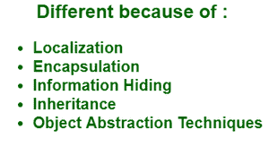

# 软件工程中的面向对象度量

> 原文:[https://www . geeksforgeeks . org/面向对象软件工程度量/](https://www.geeksforgeeks.org/object-oriented-metrices-in-software-engineering/)

这些用于确定一个人的成功或失败，也用于量化软件在其整个过程中的改进。这些度量可以用来加强优秀的面向对象编程技术，从而产生更可靠的代码。面向对象的软件工程度量是用于描述以下特征的度量单位:

*   面向对象的软件工程产品，例如，设计源代码和测试用例。
*   面向对象的软件工程过程，例如设计和编码。
*   面向对象的软件工程人员，例如，个人设计师的生产力。

**为什么面向对象软件工程度量不同？**

OOSE 不同，原因如下图所示:

**定位:**是将物品放置在物理上彼此接近的过程。

*   功能分解过程围绕功能定位信息。
*   数据驱动的方法将数据周围的信息本地化。
*   面向对象的方法定位对象周围的信息。

在面向对象软件中，顾名思义本地化是基于对象的。这意味着:

*   虽然我们可能会谈到对象提供的功能，但至少我们的一些度量识别和收集工作必须将“对象”视为软件的基本单元。
*   在对象系统中，功能和对象之间的本地化不是一对一的关系。例如，一个函数有多个对象，一个对象也可以有多个函数。

**封装:**是一组物品的封装。

*   封装的低级例子包括记录和数组。
*   子程序是封装的中级机制。
*   面向对象编程语言仍然有很长的封装机制，例如 C++、类、Ada 包和 Modula 3 模块。
*   对象封装:
    *   国家知识
    *   公布的功能
    *   其他对象
    *   例外
    *   常数
    *   概念

**信息隐藏:**是对物体的压制或隐藏。

*   我们只展示完成目标所需的信息。
*   信息隐藏的程度从部分受限可见到完全不可见。
*   封装和信息隐藏不是一回事，例如，一个项目可以被封装，但仍然是完全可见的。

它在诸如对象耦合和信息隐藏程度等度量中起着直接的作用。

**继承:**是一个对象从一个或多个其他对象获得特征的机制。

*   一些面向对象的语言只支持单一继承。
*   一些面向对象的语言只支持多重继承。
*   继承类型及其语义因语言而异。

有许多基于继承的面向对象软件工程度量，

*   儿童人数
*   父母人数
*   类层次嵌套级别

**抽象:**是我们只关注一个概念的重要细节，而忽略本质细节的机制。

*   这是一个相对的概念。
*   抽象也有不同的类别，例如功能数据、过程和对象抽象。
*   对象在对象抽象中被视为高级实体。

**类:**关于“类”的定义，常用的观点有三种。

*   <u>类如千篇一律</u>:对于结构相同的项目，类是一个模式、模板或蓝图。可以使用类创建的项称为实例。
*   <u>类作为实例工厂:</u>基本上类是既包含模式又包含基于该模式创建项目的机制的东西，实例就像使用类创建机制“制造”的单个项目。
*   类是使用特定模式创建的所有项目的集合，即类是该模式的所有实例的集合。