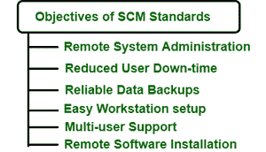

# 软件配置管理的目标

> 原文:[https://www . geesforgeks . org/软件配置管理目标/](https://www.geeksforgeeks.org/objectives-of-software-configuration-management/)

[软件配置管理(SCM )](https://www.geeksforgeeks.org/software-engineering-system-configuration-management/) 就像一个伞式活动，要应用在整个软件过程中。它管理和跟踪新兴产品及其版本，还识别和控制整个开发周期中使用的软件、硬件和工具的配置。SCM 确保参与软件过程的所有人都知道正在设计、开发、构建、测试和交付什么。

**供应链管理标准的目标:**软件配置的主要目标如下图所示:

1.  **<u>远程系统管理:</u>**
    *   对于远程系统管理工具，配置标准应包括必要的软件和/或权限。
    *   客户端的基石是为远程管理网络正确安装和配置的远程管理客户端。
    *   这些远程工具可用于检查病毒防护版本、检查机器配置或提供远程帮助台功能。
2.  **<u>减少用户停机时间:</u>**
    *   使用标准配置的一大优势是系统可以完全互换，从而减少用户停机时间。
    *   遇到不可恢复的错误时，可以将一个相同的新系统放置到位。
    *   如果无法正常工作的机器仍然可以访问，则可以传输用户数据，或者可以从备份磁带中取出最新的副本，最终目标是用户在系统界面上几乎没有变化。软件已安装。
3.  **<u>可靠的数据备份:</u>**
    *   对用户数据使用标准目录允许备份系统选择性地备份机器的一小部分，大大减少了备份系统的网络流量和磁带使用。
    *   系统和用户数据之间的分割目录结构是配置标准的主要目标之一。
4.  **<u>简易工作站设置:</u>**
    *   任何类型的标准化配置都将简化设置系统的过程，并确保重要组件可用。
    *   如果正在根据标准设置设置多台机器，大多数设置配置都可以自动化。
5.  **<u>多用户支持:</u>**
    *   为用户共享工作站并不常见。因此，系统配置设计为使用同一工作站，而不会相互干扰网络。
    *   有些软件包不支持所有用户完全独立的设置，但是，用户可以有独立的数据用户。
    *   结构的使用不会限制系统可以拥有的独立用户的数量。
6.  **<u>远程软件安装:</u>**
    *   现代软件包大多是工厂安装的预定义目录。毫无疑问，这种类型的安装对于单个用户来说是好的，但是对于机器的集合来说，这将导致不一致的配置。
    *   一个好的配置标准将在特定的目录区域安装软件，以便在逻辑上划分磁盘上的软件。
    *   在通用脚本的帮助下，很容易识别已安装的组件，并有可能自动执行安装过程。
    *   由于软件将被安装到特定的目录中，它的维护和升级运行软件变得不那么复杂。