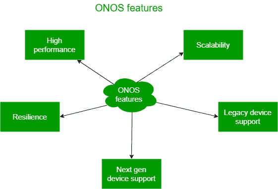
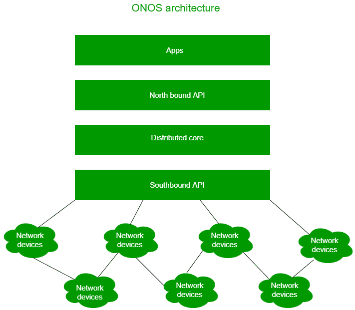

# 软件定义网络中的开放网络操作系统(ONOS)

> 原文:[https://www . geesforgeks . org/open-networking-operating-system-onos-in-software-defined-networks/](https://www.geeksforgeeks.org/open-networking-operating-system-onos-in-software-defined-networks/)

开放网络操作系统–ONOS 是一个用于构建下一代网络应用的 [SNA](https://www.geeksforgeeks.org/social-network-analysis-using-r-programming/) 控制器。使用 Onos，我们可以对网络进行实时控制，并且不需要真正的交换机来测试网络协议。ONOS 也可以在云中运行，因此，它为创新铺平了道路，并允许用户创建网络应用程序，而无需任何昂贵的设置。

ONOS 是一个开源软件，用于创建使用软件定义网络的应用程序。ONOS 是一个维护网络设备的操作系统。使用 ONOS，我们可以在软件定义的网络中控制各种硬件设备。它是由 Linux 基金会开发的。目前网络行业很多大公司都在用。

**ONOS 特色:**
ONOS 专为其打造:

ONOS 功能

*   **高性能–**
    它执行并满足网络运营商的确切规格。ONOS 的所有版本都主要针对高性能。它支持数百万个意图，惊人的响应时间仅为 50 秒。
*   **可扩展性–**
    通过添加新实例，它可以根据我们的需要进行扩展。我们还可以在 ONOS 中拥有可扩展的网关支持，从而为负载平衡和高可用性铺平道路。可扩展的网关通过允许系统有多个冗余网关来确保高可用性。它还允许动态添加或删除网关节点，并支持网关故障。
*   **弹性–**
    ONOS 为用户提供关键任务运营商网络。使用 ONOS，我们可以实现弹性控制[软件定义网络](https://www.geeksforgeeks.org/software-defined-networking/)。它可以部署在 ONOS 的顶部，以确认该方法的可行性。
*   **传统设备支持–**
    借助 ONOS，我们可以轻松添加或配置传统设备。我们可以使用基于模型的动态配置来添加服务。使用 ONOS，我们可以轻松连接 SDN 和传统设备。它可以适应任何传统设备。
*   **下一代设备支持–**
    ONOS 为原生 SDN 数据平面设备提供实时控制，现在可以与 p4 支持一起使用。ONOS 还开发了一个开源堆栈，为用户提供网络配置和控制。

**ONOS 功能:**

*   允许开放性，消除用户了解硬件设备所有权的需求。
*   用户不需要遵循专有设备的协议和复杂规则。
*   允许硬件和软件设备开发的革命和创新。
*   ONOS 因为集群而具有高可用性。
*   它的性能也很好，现在被网络工程师广泛使用。
*   它有命令行界面来调试出现的问题。
*   它支持主动和被动流量设置

**ONOS 体系结构:**

ONOS 架构

*   **分布式核心–**
    它使设备能够在集群上运行。因此，它始终可用，并可根据我们的需求进行扩展。ONOS 的中心层是 ONOS 的核心。它允许数据和控制功能的物理分离。
*   **北行抽象/API–**
    它包括各种意图或模板，允许用户在不知道服务如何工作的情况下请求网络服务。
    *例如:*在不知道后台发生什么的情况下，通过调用意图来设置两台主机之间的连接。
*   **南行抽象/API–**
    南行抽象是使用交换机和主机等网络设备构建的。南行抽象使 ONOS 能够控制所有设备，即使它们使用不同的协议。它控制 OpenFlow 协议和传统设备。
*   **软件模块化–**
    软件模块化是将较大的程序拆分成较小的程序，以便于开发和部署。ONOS 作为一个软件而存在，开发者社区可以在其中开发、调试和升级 ONOS。ONOS 中软件模块化的特性有助于软件的快速定制。

**面向下一代的 ONOS:**
ONOS 为软件定义的网络带来了一场革命。ONOS 与白盒开关和传统设备的结合带来了前所未有的革命。ONOS 的下一个目标是开发和托管一个平台，用于控制、监控、验证、诊断、实时更新和支持 5G 等各种方面。下一代 ONOS 将提高可用性、可扩展性、性能和架构。它还将支持像 gNOI、P4Runtime、gRIBI、gNMI 等 SDN 接口

下一代 ONOS 可用于以下领域，

*   **边缘网络–**
    对于边缘网络、边缘云计算操作，效率和敏捷性的原生方式由重新设计为数据中心(CORD)的中央办公室提供。因此，未来通过结合软件定义网络(SDN)和网络功能虚拟化(NFV)，我们可以为用户提供无线 5G 和企业服务交付。
*   **交通网络–**
    ONOS 未来可用于建设交通网络。职业核心网络的分离和使用白盒效率的 SDN 原则的解决方案重组可以由 ODTN(开放分类传输网络)完成。通过这样做，我们可以用很少的钱建立非常高性能的网络。
*   **数据中心–**
    ONOS 可以与 Trellis 合作，Trellis 是一个多租户数据中心解决方案，采用白盒交换机和裸机构建。

**ONOS 合作伙伴及社区:**

*   ONOS 的服务提供商包括 at&t、威瑞森、NTT 通信等。
*   ONOS 的主要供应商有 Ciena、富士通、华为、NEC、英特尔
*   ONOS 与 20 多个组织进行了合作，其中包括 Blackduck、Cnit、Kaist、NAIM、ETRI 等。

**ONOS 未来工作:**

*   未来，ONOS 的目标是从现场试验转向生产。这是目前正在发生在 AmLight。
*   下一个目标是部署更多的国际 XPs 和 RENs。
*   他们还计划测试许多商业运营商的实地试验。
*   然后，ONOS 计划测试 1.3 多表管道支持。
*   然后他们致力于支持多层应用，如网络虚拟化、VPLS、分组光学等。
*   那么 ONOS 的最终目标将是提高性能、可扩展性和稳定性。

**使用 ONOS 的公司:**

*   在康卡斯特，ONOS 正被用于建设下一代接入网。
*   Ciena 使用 ONOS 与 ONOS 构建网络编排
*   威瑞森使用 ONOS 来加速信息转换
*   ECI 正在为其公司的设备开发基于 ONOS 的 SDN 控制器。