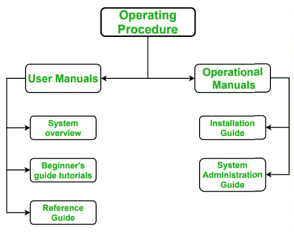

# 软件工程中的操作程序

> 原文:[https://www . geesforgeks . org/operating-procedures-in-software-engineering/](https://www.geeksforgeeks.org/operating-procedures-in-software-engineering/)

先决条件–[软件流程](https://www.geeksforgeeks.org/software-processes-in-software-engineering/)
软件由以下组件组成-

```
1. Program code
2. Documentation
3. Operating Procedures 
```

**操作规程**是组织编制的一套帮助工人进行复杂常规操作的分步说明。它包含操作软件所需的所有信息。操作程序与软件的程序代码同等重要。

操作程序包括两个模块:用户手册和操作手册。这些解释如下。



**1。用户手册:**
本手册用于描述如何操作特定软件。
用户手册包括以下内容–

*   **系统概述–**
    描述整个软件的概述。它用来定义软件的用途。
*   **初学者指南教程–**
    本指南包含操作软件的逐步过程。初学者可以知道如何使用软件及其工作原理。总的来说，这有助于了解软件。
*   **参考指南–**
    本指南是用户的帮助手册。用户可以期待参考指南中的进一步参考。

**2。操作手册:**
本手册描述了软件运行所需的硬件和软件的所有要求和支持。
操作手册包括以下内容–

*   **安装指南–**
    本指南包含软件安装的所有相关信息。
*   **系统管理指南–**
    本指南包含有关管理设置和软件所需权限的所有信息。