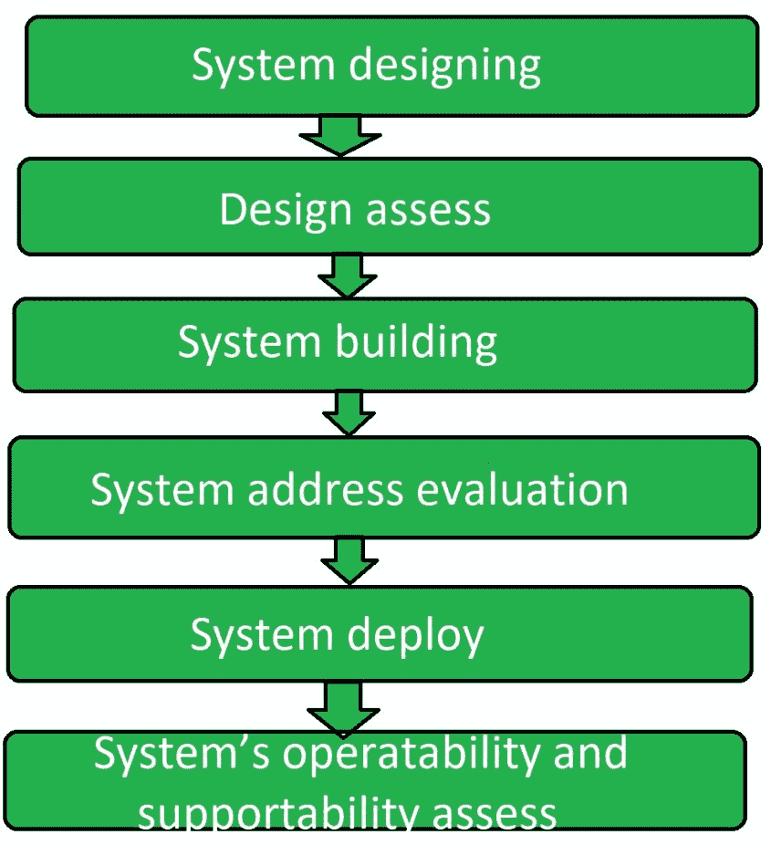

# 运行验收测试(OAT)

> 原文:[https://www . geesforgeks . org/operating-验收-测试-oat/](https://www.geeksforgeeks.org/operational-acceptance-testing-oat/)

**运行验收测试(OAT)** 是一种类型的[软件测试](https://www.geeksforgeeks.org/software-testing-basics/)，用于对软件、系统或应用程序进行运行预发布，以检查其质量。操作验收测试是一种非常常见的软件测试，其类型是非功能性的，主要用于软件开发和软件维护项目。

操作验收测试主要关注软件的操作准备情况，并成为生产环境的一部分。运行验收测试中的功能测试仅限于验证系统非功能方面所需的测试。

运行验收测试也称为运行准备测试或运行准备和保证测试(ORAT)。

**运行验收测试的目标:**
运行验收测试的目标是:

*   确定软件的弹性。
*   确定软件的恢复能力。
*   确定软件的完整性。
*   确定软件能否按照 ITIL 标准部署在网络上。
*   确定软件的可支持性。

**运行验收测试步骤:**

**系统设计:**
第一步是按照用户需求设计系统。该系统的设计满足了最终用户的需求。

**设计评估:**
系统设计完成后，对其设计进行了分析。分析了系统是否符合用户需求，是否会按照设计的方式运行。

**系统建设:**
系统设计准备完毕，分析完成后，系统建设阶段开始。这是运行验收测试的主要阶段。

**系统地址评估:**
系统搭建完成后，对该系统地址进行评估，检查是否符合用户需求。

**系统部署:**
在对软件进行构建和地址评估后，根据执行其构建目的的特定任务来建立。

**系统的可操作性和保障性评估:**
现在在最后一个阶段测试软件系统或应用程序的可操作性和保障性。这导致整个程序的结束。

**运行验收测试类型:**

*   负载测试
*   性能试验
*   安装测试
*   备份和恢复测试
*   安全测试
*   恢复测试