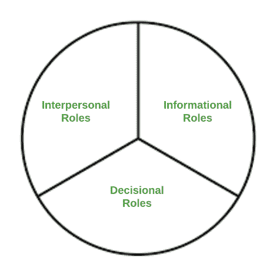
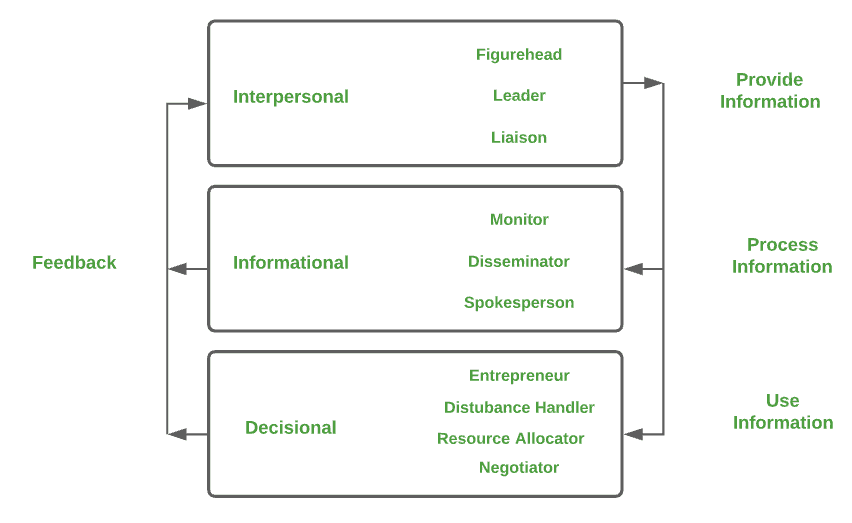

# 组织行为–经理的角色

> 原文:[https://www . geeksforgeeks . org/org-组织-行为-管理者角色/](https://www.geeksforgeeks.org/organizational-behaviour-role-of-managers/)

**什么是组织行为？**
组织行为学顾名思义，就是在一个组织内部理解和管理人类行为的过程。一个组织不仅要靠利润、工作和时间表来运转，还要考虑人的价值。组织提出了这样一种理论，即当员工得到良好的对待和理解时，组织就会运转良好，因为整个组织都依赖于人力资源。

组织行为研究并收集关于员工行为的见解，如如何通过更好地理解员工来激励他们。组织行为应该从管理者的角色开始，以及他们如何将道德和支持融入到层级中。管理主义不仅仅是获取利润和执行控制，而是为不同意见的互动创造一个安全的空间，并能够作为一个群体工作，实现组织目标。就像他们说的，团队里没有我。一起工作，一起成长的组织。

所有这些都归结为这样一个问题，经理应该扮演什么角色，记住在组织行为方面应该对他/她有什么期望？

#### 经理的角色:

**1。人际角色:**

*   **图头–**
    在这个角色中，经理履行礼仪性质的职责，比如，参加员工的婚礼，带客户去吃午饭，问候旅游政要等等。
*   **领导者角色–**
    在这个角色中，经理是领导者，用适当的激励和鼓励引导员工走上正确的道路。
*   **联络角色–**
    在这个角色中，经理培养垂直指挥链之外的联系人，为组织收集有用的信息。

**2。信息角色:**

*   **监控角色–**
    在这个角色中，经理扮演着一个监控者的角色，不断地扫描环境中的信息，关注联系人和下属，并接收主动提供的信息。
*   **传播者角色–**
    在这个角色中，经理扮演传播者的角色，将特权信息传递给下属，否则他们将无法访问这些信息。
*   **发言人角色–**
    在这个角色中，经理扮演发言人的角色，在与组织有一定利害关系的各种外部团体面前代表组织。这些利益相关者可以是政府官员、工会、金融机构、供应商、客户等。他们对组织有广泛的影响，所以经理应该通过有效管理组织的社会影响来获得他们的支持。

**3。决策角色:**

*   **企业家角色–**
    在这个角色中，管理者充当了企业家的角色，总是渴求新的知识和创新来改善组织。如今，组织是更大还是更好并不重要，但它必须持续增长。创新是创造新的想法，这些想法可能导致新产品或服务的开发，也可能是对旧想法的改进。这使得创新成为管理者的一项重要职能。
*   **干扰处理者角色–**
    在这个角色中，经理扮演一个干扰处理者，在这个角色中，经理必须像消防员一样被动地工作。经理应该对出现的任何问题提出解决方案，并有条不紊地处理。
*   **资源分配器角色–**
    在这个角色中，经理充当资源分配器的角色，在这个角色中，经理必须在下属之间分配工作和授权。经理应该根据能力来计划哪个下属会得到什么，以及谁更适合某项任务。
*   **谈判者–**
    在这个角色中，经理扮演着谈判者的角色，在这个角色中，所有级别的经理都必须花费相当多的时间进行谈判。公司总裁可以与工会领导人就新的罢工问题进行谈判，或者工头可以与工人就申诉问题进行谈判，等等。

经理角色的工作流程

参考[https://en.wikipedia.org/wiki/Organizational_behavior](https://en.wikipedia.org/wiki/Organizational_behavior)