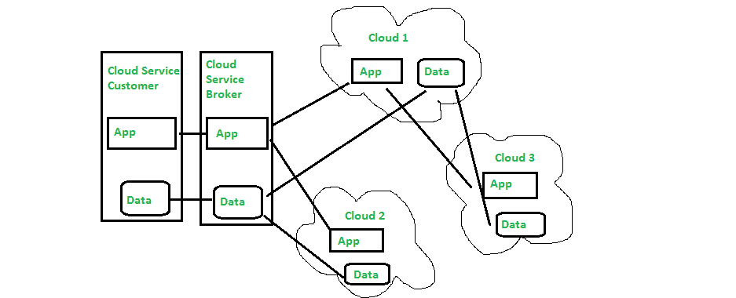

# 云互操作性和可移植性概述

> 原文:[https://www . geesforgeks . org/云概述-互操作性和可移植性/](https://www.geeksforgeeks.org/overview-of-cloud-interoperability-and-portability/)

**先决条件:** [云计算](https://www.geeksforgeeks.org/cloud-computing/)

如今，推动其数字化转型的每个组织/企业都在越来越多地转向基于云的解决方案。但是合适的互操作性和可移植性是非常重要的。因此，在本文中，我们将讨论云的互操作性和可移植性，它的主要类别，以及需要它的各种场景，以及在此期间面临的挑战。因此，让我们深入了解一下这个概念，以了解这种云的互操作性和可移植性。

**互操作性:**
它被定义为至少两个系统或应用程序与数据进行交易并加以利用的能力。另一方面，云互操作性是一个云服务通过按照策略交易数据以获得结果而与另一个云服务连接的能力或程度。

云互操作性的两个关键组成部分是可用性和连接性，它们被进一步划分为多个层。

1.  行为
2.  政策
3.  语义的
4.  句法的
5.  运输
6.  轻便

它是将数据或应用程序从一个框架转移到另一个框架，使其保持可执行或可用的过程。可移植性可以分为两种:云数据可移植性和云应用程序可移植性。

*   **云数据可移植性–**
    它是将信息从一个云服务移动到另一个云服务等的能力，而无需期望重新输入数据。
*   **云应用程序可移植性–**
    它是将应用程序从一个云服务移动到另一个云服务或在客户端环境和云服务之间移动的能力。

**云计算互操作性和可移植性的类别:**
云的可移植性和互操作性可以分为–

*   数据可移植性
*   平台互操作性
*   应用程序可移植性
*   管理互操作性
*   平台可移植性
*   应用程序互操作性
*   出版和采购互操作性

1.  **数据可移植性–**
    数据可移植性，也称为云可移植性，是指将数据从一个来源传输到另一个来源，或者从一个服务传输到另一个服务，即从一个应用程序传输到另一个应用程序，或者从一个云服务传输到另一个云服务，目的是在不影响可用性的情况下为客户提供更好的服务。此外，它使云迁移过程更加容易。
2.  **应用可移植性–**
    它支持在不同的云 PaaS 服务中重用各种应用组件。如果组件在其云服务提供商中是独立的，那么应用程序可移植性对于企业来说可能是一项困难的任务。但是如果组件不是特定于平台的，那么移植到另一个平台是很容易的。
3.  **平台可移植性–**
    平台可移植性有两种——平台源可移植性和机器映像可移植性。在平台源可移植性的情况下，例如，UNIX 操作系统，它大部分是用 C 语言编写的，可以通过在各种不同的硬件上重新编译和重新编写硬件相关的部分来实现，这些部分不是用 C 语言编码的。机器映像可移植性通过移植需要标准程序表示的结果包来将应用程序与平台绑定。
4.  **应用互操作性–**
    它是部署在系统中的应用的已部署组件之间的互操作性。一般来说，基于设计原则构建的应用程序比那些不基于设计原则的应用程序表现出更好的互操作性。
5.  **平台互操作性–**
    是部署在一个系统中的平台的已部署组件之间的互操作性。这是一个重要的方面，因为没有平台互操作性就无法实现应用程序互操作性。
6.  **管理互操作性–**
    这里，评估了 SaaS、PaaS 或 IaaS 等云服务以及与自助服务相关的应用。由于云服务允许企业在内部工作并消除对第三方的依赖，因此它将占据主导地位。
7.  **发布与获取互操作性–**
    一般来说，是 PaaS 服务等各种平台与在线市场之间的互操作性。

**下图展示了云互操作性和可移植性的概述:**

云互操作性和可移植性

**需要互操作性和可移植性的主要场景:**
云标准定制委员会(CSCC)已经确定了一些需要可移植性和互操作性的基本场景。

*   **云服务提供商之间的切换–**
    客户希望将数据或应用程序从云 1 传输到云 2。
*   **使用多个云服务提供商-**
    客户端可以订阅相同或不同的服务，例如云 1 和云 2。
*   **直连云服务-**
    客户可以通过连接到云 1 和云 3 来使用服务。
*   **混合云配置-**
    这里，客户连接的不是公共云中的遗留系统，而是私有云，即云 1，然后连接到公共云服务，即云 3。
*   **云迁移-**
    客户端迁移到一个或多个内部应用程序到云 1。

**云可移植性和互操作性面临的挑战:**

*   如果我们将应用程序移动到另一个云中，那么数据自然也会移动。而对于一些企业来说，数据是非常关键的。但不幸的是，大多数云服务提供商收取少量费用将数据放入云中。
*   数据的移动程度也会成为一个障碍。将数据从一个云移动到另一个云，还应该访问将工作负载从一台主机移动到另一台主机的功能。
*   不应该忽略互操作性，否则数据迁移会受到很大影响。因此，应该确保所有组件和应用程序的功能。
*   由于数据在业务中非常重要，因此应确保客户数据的安全。

云互操作性通过提供定制接口消除了复杂的部分。从一个框架转移到提高可伸缩性的容器服务是可以想象的。有几个障碍，对服务提供商变化的适应性，对云客户端更好的帮助将增强云互操作性的提高。