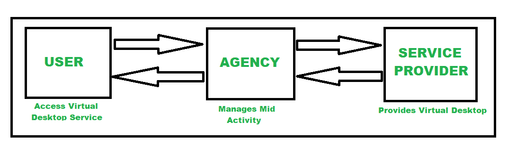

# 桌面即服务概述(DaaS)

> 原文:[https://www . geeksforgeeks . org/桌面即服务概述-daas/](https://www.geeksforgeeks.org/overview-of-desktop-as-a-service-daas/)

**先决条件:** [云计算](https://www.geeksforgeeks.org/cloud-computing/)

**简介:**
有[不同的云服务模式](https://www.geeksforgeeks.org/cloud-based-services/)有像 SaaS、PaaS、IaaS 等，现在甚至一切都可以借助云计算成为服务。这就是为什么[一切/任何事物即服务(XaaS)](https://www.geeksforgeeks.org/overview-of-everything-as-a-service-xaas/) 出现的原因。就这样，随着云技术的发展，桌面即服务应运而生。因此，在本文中，我们将更多地了解桌面即服务，它是如何工作的，何时可以使用它，以及我们将从中获得的好处。所以，让我们深入了解一下。

**桌面即服务:**
DaaS 代表桌面即服务。它是一种云计算技术，允许用户使用虚拟桌面从远程的集中式数据服务器通过互联网访问数据和应用程序。因此，它是由第三方主机提供的一种桌面虚拟化。DaaS 也被称为虚拟桌面或托管桌面服务。
现在想到的重点是在哪种情况下我们可以使用它。让我们看一个实时的例子。

**示例–**一个组织让其员工在家工作，很快它可能成为 it 工作流程的未来。现在，无论是笔记本电脑、平板电脑还是移动电话，组织都希望通过从员工使用的设备中访问组织中的数据来支持员工开展项目。
在这种情况下，组织必须在集中的服务器中提供数据，以便所有员工都可以访问数据。虚拟桌面基础架构(VDI)可以满足这一要求。
但是设置虚拟桌面基础架构太贵，而且耗费资源，例如需要服务器、硬件、软件和熟练的员工来设置和维护虚拟桌面基础架构。这是我们需要 DaaS 的时候。DaaS 帮助人们借助互联网远程访问数据和应用程序，无论他们使用什么设备访问。桌面即服务(DaaS)具有成本效益，可确保安全性和控制力。

**我们将从 DaaS 得到什么好处？**

*   它比设置和维护虚拟桌面更便宜
*   可以快速添加新用户或删除现有用户，这意味着可以轻松管理。
*   它可以在任何地方的任何设备上为任何用户提供高性能的工作空间。这些好处成为选择 DaaS 而不是 VDI 的理由。

**哪里可以用？**
DaaS 有很多用例。它可以被多个平台用于多种目的。
我们来看看它的一些用例。

1.  软件开发人员
2.  呼叫中心，兼职工作
3.  大学实验室
4.  远程和移动工作人员
5.  轮班和合同工作

**DaaS 的工作流程:**
借助 DaaS，服务提供商将基础设施、网络资源和存储托管在云中。然后，服务提供商流式传输虚拟桌面，用户可以通过互联网访问桌面数据和应用程序。因此，用户可以无缝地访问图形密集型应用程序，即使用户的设备通常无法在不冻结和像素化的情况下运行如此高性能的应用程序。

该组织拥有完全控制权，可以在几下点击中添加另一个用户或撤销现有用户。安全性很高，因为数据不存储在用户的任何本地设备上。所有数据都存储在中央数据服务器上。即使用户的设备落入坏人之手，从该设备到数据服务器的访问也会立即被拒绝。任何安全补丁或更新都可以轻松完成，因为它们需要在集中式服务器上一次性完成。
这里，服务提供商负责备份、更新、数据存储等后端管理。用户可能只管理服务的安全方面，或者服务提供商也将处理它。
下图为工作流程架构。

DaaS 有两种类型的台式机

**1。持久桌面–**

*   在这种类型中，用户可以自定义虚拟桌面的外观，并且每当用户重新登录时，详细信息将保持不变。
*   这需要更多的存储空间，所以很贵。

**2。非持久桌面–**

*   每次用户注销时，桌面都会被清除，它只是作为共享云服务的入口。

**部分 DaaS 提供商为:**
市场上有多家供应商提供虚拟桌面服务。
以下是一些要求苛刻的供应商–

1.  亚马逊工作区
2.  思杰托管桌面
3.  微软视窗虚拟桌面
4.  VMware 地平线云
5.  进化知识产权
6.  托管桌面云化等。

**DaaS 优势:**

*   **活动终端用户的快速部署和退出使用–**
    DaaS 可以快速向终端用户提供服务，也可以更快撤销服务。
*   **高成本节约–**
    设置和维护虚拟设备基础架构的成本更低。
*   **简易用户界面–**
    界面简单，一个有易用性技能的普通 IT 员工都能使用。
*   **增加设备灵活性–**
    用户数量可根据需求轻松增减。
*   **提高安全性–**
    它作为一项虚拟服务，提供了高度安全性，降低了对网络攻击和风险的恐惧。

**DaaS 的劣势:**

*   **互联网中断–**
    在互联网中断的情况下，员工可能无法访问他们的桌面，因为这些桌面托管在云中并通过互联网访问。
*   **虚拟性能差–**
    有时可能会发生终端用户在虚拟访问时面临虚拟性能差的情况，因此任何技术故障都无法避免。