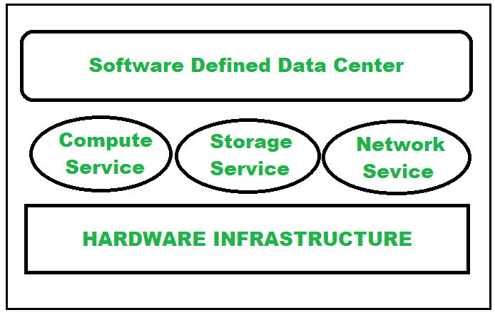

# 软件定义的数据中心(SSDC)概述

> 原文:[https://www . geesforgeks . org/软件定义数据中心概述-ssdc/](https://www.geeksforgeeks.org/overview-of-software-defined-data-center-ssdc/)

**SSDC :** 软件定义的数据中心简称 SSDC，由 VMware 的 CTO Steve Herrod 博士创造。指的是一个虚拟化的数据中心，其中所有基础架构元素网络、存储、CPU(计算)和安全性都被虚拟化，并作为 ITaaS(基础架构即服务)交付。虽然服务器虚拟化仅提供计算服务，但 SSDC 将虚拟化从基本计算扩展到存储服务和网络资源。在软件定义的数据中心中，部署、操作、供应和配置都是通过支持策略驱动的自动化或实现软件智能从硬件中抽象出来的，这不仅加快了资源交付，还提高了效率。SSDC(软件定义的数据中心)也称为固态硬盘(软件定义的数据中心)或虚拟数据中心(虚拟数据中心)。

提供 SDDC 硬件和服务的供应商有亚马逊、戴尔/VMware、微软、惠普企业、甲骨文、IBM 和思杰等。

**SSDC 成分:**

1.  **虚拟化计算****–**
    计算虚拟化或服务器虚拟化掩盖了服务器资源，因此管理员使用虚拟机在单个服务器上运行和使用多个不同的应用程序和操作系统。因此，用户和组织不必管理复杂的服务器资源细节。
2.  **虚拟化存储–**
    存储虚拟化将多个网络存储设备中的物理存储资源汇集在一起，消除了互不连接的存储系统，呈现出由中央集线器管理的单个存储设备的外观。它提供了灵活性、可扩展性和可伸缩性，使其更加动态。
3.  **虚拟化网络–**
    网络虚拟化结合了网络资源，允许独立于物理硬件/通道来供应和管理网络，从而使分配和重新分配给特定服务器变得更加灵活。

下图说明了软件定义的数据中心的组件:

在进入 SSDC 之前，请记住以下几点，以便更好地顺利实施 SSDC 计划。因为有时组织会在没有任何准备的情况下跳入软件定义的数据中心，并面临巨大的失败和财务损失。因此，我们建议，当一个组织准备好转型并与 SSDC 合作时，最好跳进 SSDC。

1.  与公司合作采用新技术。
2.  DevOps 团队在 SSDC 扮演着重要的角色，因此了解组织的 DevOps 团队的能力和局限性。
3.  监控组织的基本软件基础设施。
4.  监控组织对计算和存储服务的需求。

**实施 SSDC 的好处:**

*   提高业务生产力
*   降低成本
*   更快的信息技术服务交付
*   提高基础设施性能
*   提高可扩展性
*   提供更多存储容量
*   提高业务灵活性
*   减少信息技术资源的使用
*   自动化部署和管理
*   允许基础设施和应用程序现代化。

**实施 SSDC 的挑战:**

*   跨团队的标准化是一个问题
*   需要提高 DevOps 技能
*   切换到 SSDC 的新环境
*   需要改变组织的现有流程和工作流程