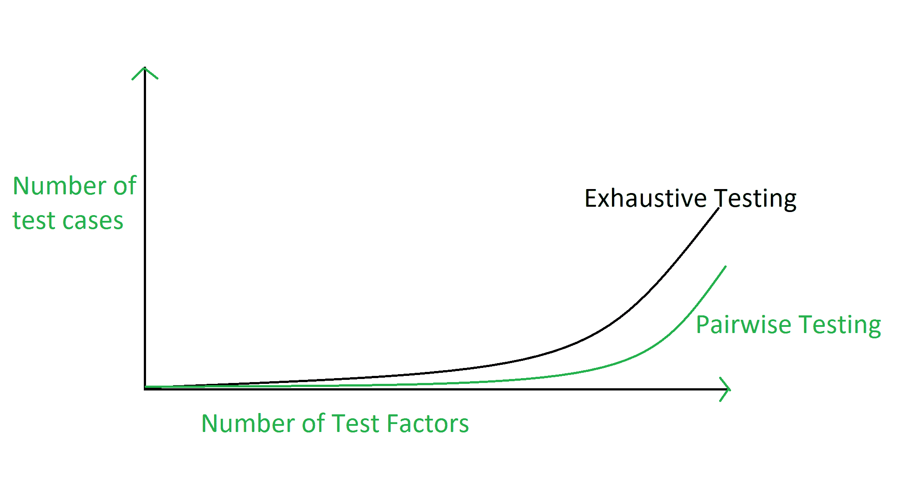

# 成对软件测试

> 原文:[https://www.geeksforgeeks.org/pairwise-software-testing/](https://www.geeksforgeeks.org/pairwise-software-testing/)

**成对测试**是一种利用排列组合的方法对软件进行测试的软件测试类型。成对测试用于测试所涉及参数的所有可能的离散组合。

成对测试是一种基于 P&C 的方法，其中为了测试系统或应用，对于系统的每对输入参数，测试参数的所有可能的离散组合。通过使用传统的或详尽的测试方法，可能很难测试系统，但是通过使用排列和组合方法，可以很容易地完成。

**示例:**
假设有一个要测试的软件，该软件有 20 个输入和 20 个可能的设置用于每个输入，因此在这种情况下，总共有 20 个 20^20 可能的输入要测试。因此，在这种情况下，即使尝试测试所有组合，穷尽测试也是不可能的。

**成对测试的图形表示:**



**成对测试的广义形式:**
成对测试的广义形式是 **N 向测试。**基本上排序适用于集合，

```
X = n{i}, 
so that P = P{i} gets ordered too. 
```

假设排序后的集合是一个 N 元组:

```
P{s} = { P{i} } ;  i  |R(P{i})| < |R(P{j})|
Now take the set X(2) = { P{N-1}, P{N-2} } 
```

称之为成对测试。推广进一步采取集合

```
X(3) = { P{N-1}, P{N-2}, P{N-3} }
```

称之为三向测试。同样，我们可以说，

```
X(K) = { P{N-1}, P{N-2}, ..., P{N-K} } 
```

k 方向测试。
N 向测试是上述公式的所有可能组合。

**成对测试的优势:**
成对测试的优势有:

*   成对测试减少了测试用例的执行次数。
*   成对测试将测试覆盖率几乎提高了 100%。
*   成对测试提高了缺陷检测率。
*   成对测试花费更少的时间来完成测试套件的执行。
*   成对测试减少了项目的整体测试预算。

**成对测试的缺点:**
成对测试的缺点是:

*   如果变量的值不合适，成对测试是没有好处的。
*   在成对测试中，在选择测试数据时，可能会遗漏高度可能的组合。
*   在成对测试中，如果遗漏一个组合，缺陷成品率可能会降低。
*   如果没有正确理解变量的组合，成对测试就没有用。