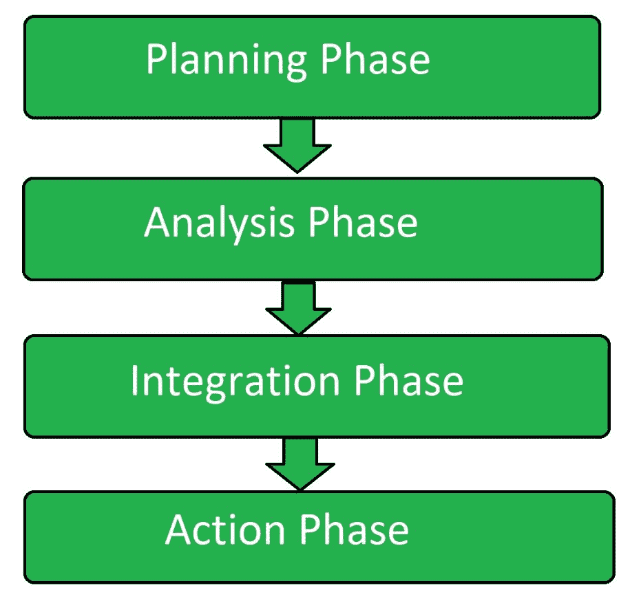

# 范例软件测试

> 原文:[https://www.geeksforgeeks.org/paradigm-software-testing/](https://www.geeksforgeeks.org/paradigm-software-testing/)

**范例测试**是一种类型的[软件测试](https://www.geeksforgeeks.org/software-testing-basics/)，其被执行以提供可重复的重要结果，并且在此基础上新软件版本的规范和性能可被标准化。它是用来比较软件系统性能的测试技术。

范例测试是 SDLC 的一个组成部分，开发人员和数据库管理员都参与其中，以确定当前的性能，并根据基准进行更改，以提高系统的性能。编码和数据库管理一起非常高效地完成，因此用户可以体验到性能的提高。

**范式测试的目标:**
范式测试的目标是:

*   为软件系统或应用程序提供可访问性。
*   为应用程序提供 HTML 合规性。
*   向最终用户提供浏览器兼容性。
*   提供链接人气。
*   提供有效的装载时间。

**范例测试的属性:**

*   这应该意义重大。
*   应该是可重复的。
*   测试环境应该相同。
*   其他应用程序应该处于非活动状态。

**范例测试属性:**

*   **SQL 查询、索引和过程:**
    这些与数据库测试相关，也包括结构、功能和非功能测试。
*   **硬件配置:**
    硬件的设计以及硬件的内部配置如何与系统软件交互。
*   **应用程序代码:**
    定义应用程序基本特征和任务的编程代码。
*   **网络:**
    连接及其建立是基准测试的关键属性之一。它在数据库测试期间也很有用。
*   **防火墙:**
    防火墙是为了网络的安全目的。它主要用作网络中的检测和入侵设备。

**范式测试的步骤:**
范式测试有四个步骤:

**规划:**
这是测试基准初始阶段的开始阶段。在这个阶段，需求的识别和标准的优先化已经完成。基准标准和测试流程在此阶段定义。

**分析:**
这是基准测试的第二阶段，在该阶段中，识别错误的根本原因，以确保完成高质量的软件。

**整合:**
这是基准测试的第三个阶段，在这个阶段，结果与各自的人共享，并且他们批准。功能的目标已经设定。

**动作:**
这是基准测试的最后阶段。制定测试计划，并实施前几个阶段规定的措施。流程在此阶段持续运行。

**范例测试工具:**

*   Prime95
*   Novabench
*   3D 标志
*   桑德拉软件公司
*   Cinebench(电影)
*   极客长凳
*   佛罗尼克斯
*   cpu-z
*   维拉莫