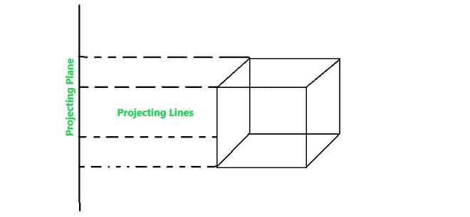
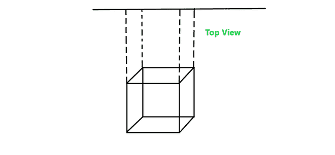
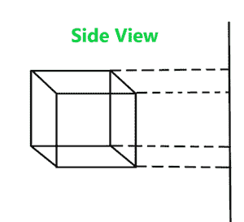
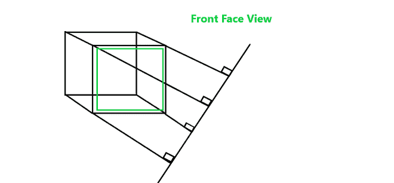
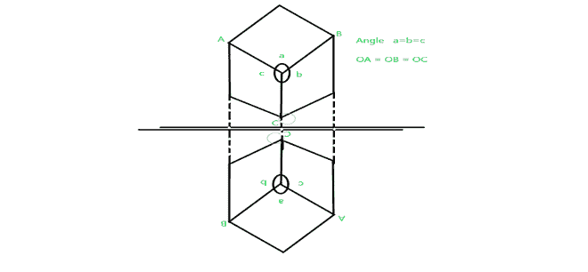
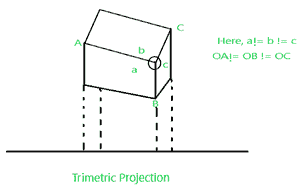
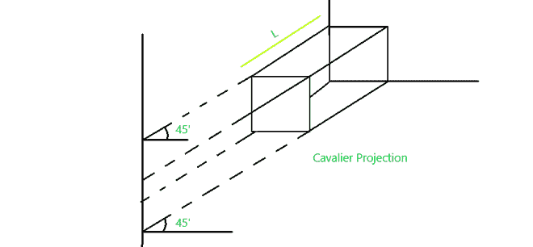
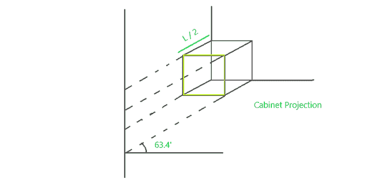

# 计算机图形学中的平行(相面&斜)投影

> 原文:[https://www . geeksforgeeks . org/parallel-oth graphic-斜角投影计算机图形学/](https://www.geeksforgeeks.org/parallel-othographic-oblique-projection-in-computer-graphics/)

投影是计算机图形学中使用的一种现象，它将三维物体的视图映射到投影显示面板上，其中观察体积由世界坐标指定，然后将这些世界坐标映射到观察端口上。

**投影属于以下类型:**

```
 a) Parallel Projection               b) Perspective Projection
```

**平行投影:**平行投影是投影线从多边形表面平行出射，然后平行入射到平面上的一种投影。在平行投影中，投影的中心位于无穷远处。在平行投影中，在平面上获得的物体视图不太真实，因为没有缺点。并且对象的相对尺寸保持不变。



**平行投影进一步分为两类:**

```
a) Orthographic Projection

b) Oblique Projection
```

**(a)正投影:**是投影线从物面平行出射，在投影面垂直入射的一种平行投影。

**正投影分为两类:**

**(一)。多视角投影:**进一步分为三类–

**(1)俯视图:**在该投影中，观察到从多边形表面顶部射出的光线。



**2) <u>侧视图</u> :** 这是观察多边形表面侧视图的另一种投影正投影。



**3) <u>正视图</u> :** 在该正投影中，观察到物体的正视图。



**a.2) <u>轴测图</u> :** 轴测图是正投影，投影线垂直于投影平面，物体围绕其一个或多个轴旋转，以显示多面。

它进一步分为三类:

**(1)等角投影:**是一种在技术和工程图纸中以二维显示的方式直观表示三维物体的方法。在这个投影中，三个坐标轴看起来同样缩短，并且其中任意两个坐标轴之间的角度为 120 度。



**(2)三维投影:**是一种正投影，被可视化的物体看起来只有两条相邻的边，角度相等。


**(3)三度投影:**是一种正投影，被可视化的物体看起来所有相邻的边和角度都不相等。



**(b)斜投影:**是投影光线从多边形表面平行出射，在平面上以 90 度以外的角度入射的一种平行投影。

它有两种:

**(b)。骑士投影:**是投影线从物面平行出射，在投影面以 45°入射而不是 90°入射的一种斜投影。在该投影中，读取轴的长度大于机柜投影。



**(b)。2.柜式投影:**与骑士投影相似，但此处读取轴的长度仅为骑士投影的一半，投影平面的入射角为 63.4°而非 45°。

