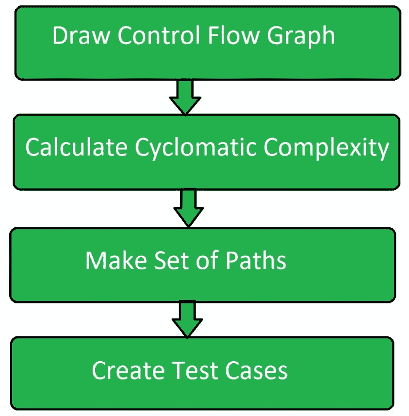

# 软件工程中的路径测试

> 原文:[https://www . geesforgeks . org/path-软件工程中的测试/](https://www.geeksforgeeks.org/path-testing-in-software-engineering/)

**路径测试**是一种用于设计测试用例的方法。在路径测试方法中，程序的控制流图被设计成寻找一组线性独立的执行路径。在这种方法中，圈复杂度用于确定线性独立路径的数量，然后为每个路径生成测试用例。

它给出了完整的分支覆盖，但没有覆盖控制流图的所有可能路径。麦凯布的圈复杂度用于路径测试。这是一种结构化测试方法，它使用程序的源代码来找到每一个可能的可执行路径。

**路径测试流程:**



*   **控制流图:**
    画出程序对应的控制流图，其中所有可执行路径都要被发现。
*   **圈复杂度:**
    生成控制流图后，使用以下公式计算程序的圈复杂度。

    ```
    McCabe's Cyclomatic Complexity = E - N + 2P

    Where, 
    E = Number of edges in control flow graph
    N = Number of vertices in control floe graph
    P = Program factor 
    ```

*   **制作集合:**
    根据控制 floe 图和计算的圈复杂度制作一组所有路径的集合。集合的基数等于计算的圈复杂度。
*   **创建测试用例:**
    为上述步骤中获得的集合的每个路径创建测试用例。

**路径测试技术:**

*   **控制流图:**
    通过将代码表示成节点和边，将程序转换成控制流图。
*   **决策到决策路径:**
    控制流图可以分解成各种决策到决策路径，然后折叠成单个节点。
*   **独立路径:**
    独立路径是通过决策到决策路径图的路径，不能通过其他方法从其他路径复制。

    **路径测试的优势:**

    1.  路径测试方法减少了冗余测试。
    2.  路径测试侧重于程序的逻辑。
    3.  路径测试用于测试用例设计。