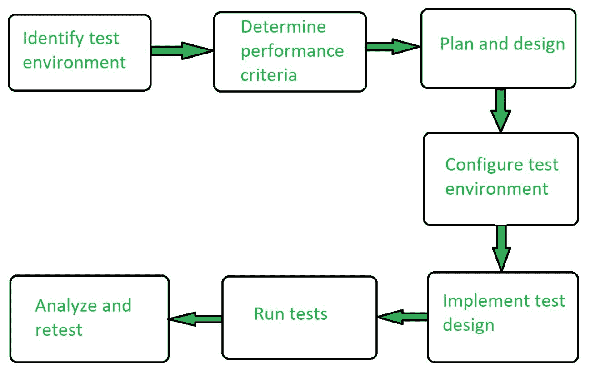

# 性能测试|软件测试

> 原文:[https://www . geesforgeks . org/performance-testing-software-testing/](https://www.geeksforgeeks.org/performance-testing-software-testing/)

先决条件–[软件测试类型](https://www.geeksforgeeks.org/types-software-testing/)
**性能测试**是一种软件测试类型，确保软件应用程序在其预期工作负载下正常运行。这是一种测试技术，用于根据特定工作负载下的灵敏度、反应性和稳定性来确定系统性能。

性能测试是分析产品质量和能力的过程。这是一种测试方法，用于确定系统在不同工作负载下的速度、可靠性和稳定性。性能测试也称为 ***性能测试*** 。

**性能测试属性:**

*   **速度:**
    决定软件产品是否快速响应。
*   **可扩展性:**
    它决定了软件产品一次可以处理的负载量。
*   **稳定性:**
    它决定了软件产品在工作负载变化的情况下是否稳定。
*   **可靠性:**
    它决定软件产品是否安全。

**性能测试目标:**

1.  性能测试的目标是消除性能拥塞。
2.  它揭示了产品上市前需要改进的地方。
3.  性能测试的目的是使软件快速。
4.  性能测试的目的是使软件稳定可靠。

**性能测试类型:**

1.  ***负载测试* :**
    它检查产品在预期用户负载下的性能。目标是在软件产品上市之前识别性能拥塞。
2.  ***压力测试* :**
    它包括在极端工作负载下测试一个产品，看它是否能处理高流量。目标是确定软件产品的转折点。
3.  ***:*** *进行耐久测试是为了保证软件能够长时间处理预期负载。*
4.  ****尖峰测试* :**
    测试产品对用户产生的负载突然出现大尖峰的反应。*
5.  ****批量测试* :**
    在批量测试中，大量数据保存在数据库中，并观察整个软件系统的行为。目标是检查产品在不同数据库容量下的性能。*
6.  ****可伸缩性测试* :**
    在可伸缩性测试中，软件应用程序的有效性是由支持用户负载增加的可伸缩性决定的。它有助于规划软件系统的容量增加。*

***性能测试流程:***

**

***性能测试工具:***

1.  *[Jmeter](http://jmeter.apache.org/)*
2.  *[开放 STA](http://opensta.org/)*
3.  *[加载转轮](http://www.hp.com/)*
4.  *[网络负载](http://www.radview.com/)*