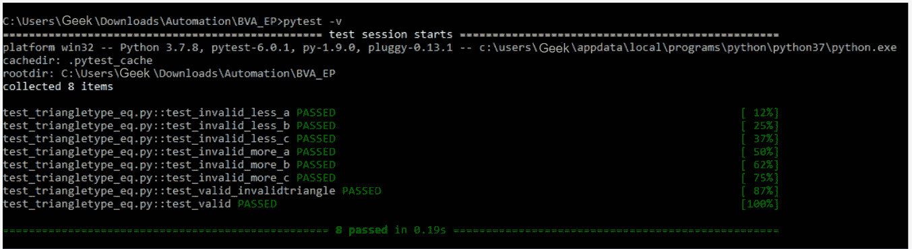
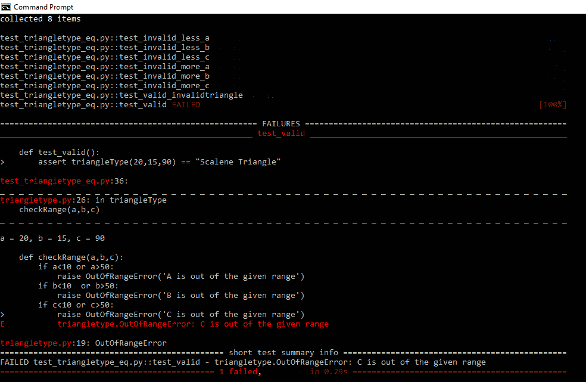

# 使用 Pytest

执行等价类测试

> 原文:[https://www . geesforgeks . org/performing-等价类-测试-使用-pytest/](https://www.geeksforgeeks.org/performing-equivalence-class-testing-using-pytest/)

先决条件–[等价类测试](https://www.geeksforgeeks.org/equivalence-class-testing-next-date-problem/)

为了执行自动化的等价类测试，我们可以使用 Pytest 或 Unittest Python 库。在本文中，我们将使用 Pytest 库来执行一个简单程序的测试用例。

**问题:**
给定三角形的三条边 A、B 和 c 的长度，对确定三角形类型的程序进行等价性测试。边的长度范围在 10 到 50 之间(包括 10 和 50)。

**triangletype.py** 文件中的代码:

## 蟒蛇 3

```
# import math

# parent class for Error
class Error(BaseException):
    pass

# child class of Error named OutOfRangeError
class OutOfRangeError(Error):
    def __init__(self, message):
        self.message = message

# child class of Error named TriangleError        
class TriangleError(Error):
    def __init__(self, message):
        self.message = message

# checks if variables are in range
# if variables not in range then OutOfRangeError is raised
def checkRange(a, b, c):
    if a<10 or a>50:
        raise OutOfRangeError('A is out of the given range')
    if b<10  or b>50:
        raise OutOfRangeError('B is out of the given range') 
    if c<10 or c>50:
        raise OutOfRangeError('C is out of the given range')

# checks if the given values of a, b, c can form a triangle
# if not, then Triangle error is raised
def checkTriangle(a, b, c):
    if a + b<= c or b + c<= a or c + a<= b:
        raise TriangleError('Triangle cannot be formed with these sides')

# determines the type of triangle        
def triangleType(a, b, c):
    checkRange(a, b, c)
    checkTriangle(a, b, c)
    # s = (a + b+c)/2
    # ar = math.sqrt(s*(s-a)*(s-b)*(s-c))
    # inradius = ar / s
    if(a == b and b == c):   
        return "Equilateral Triangle"
    elif(a == b or a == c or b == c):
        return "Isosceles Triangle"
    else:
        return "Scalene Triangle"

def main():
    try:
        print("Enter the sides of the triangle in range [10-50]")

        a = int(input('Enter Side A:'))
        b = int(input('Enter Side B:'))
        c = int(input('Enter Side C:'))
    except ValueError as v:
        print(v + " Raised :Input is not an integer.")
        exit(0)
    try:
        checkRange(a, b, c)
    except OutOfRangeError as e:
        print("OutOfRangeError:" + e.message)

    try:
        checkTriangle(a, b, c)
    except TriangleError as e:
        print('TriangleError:' + e.message)

    typeOfTriangle = triangleType(a, b, c)

    print("The triangle is: " + typeOfTriangle)

if __name__ == "__main__":
    main()
```

现在，我们需要使用 Pytest 库为上述程序编写测试用例。每个测试用例都写在一个单独的函数中，我们使用*pytest . rails*函数来检查给定的输入是有效还是无效。对于上面的程序，我们创建了 7 个*无效类*和 *1 个* *有效类。*7 个无效类为:

*   *a < 10*
*   *一> 50*
*   *b < 10*
*   *b > 50*
*   *c < 10*
*   *c > 50*
*   给定的 *a、b、c* 值不能形成三角形

*1 有效类*为:

*   *10 < = a、b、c < = 50*

**注意:**函数名和测试文件名应该总是以‘test’这个词开头。

*test_triangletype_eq.py* 文件中的代码:

## 蟒蛇 3

```
import pytest

# importing classes and function which we use in this file
from triangletype import OutOfRangeError
from triangletype import TriangleError
from triangletype import triangleType

# check if a < 10
def test_invalid_less_a():
    with pytest.raises(OutOfRangeError):
        triangleType(9, 20, 15)

# check if b < 10        
def test_invalid_less_b():
    with pytest.raises(OutOfRangeError):
        triangleType(20, 9, 15)

# check if c < 10        
def test_invalid_less_c():
    with pytest.raises(OutOfRangeError):
        triangleType(20, 15, 9)

# check if a > 50
def test_invalid_more_a():
    with pytest.raises(OutOfRangeError):
        triangleType(51, 30, 45)

# check if b > 50        
def test_invalid_more_b():
    with pytest.raises(OutOfRangeError):
        triangleType(30, 51, 45)

# check if c > 50        
def test_invalid_more_c():
    with pytest.raises(OutOfRangeError):
        triangleType(30, 45, 51)

# check if a, b, c can form a triangle or not        
def test_valid_invalidtriangle():
    with pytest.raises(TriangleError):
        triangleType(20, 15, 40)

# valid class - determines type of triangle        
def test_valid():
    assert triangleType(20, 15, 10) == "Scalene Triangle" 
```

要执行上述测试用例，在一个文件夹中创建两个单独的文件 *triangletype.py* 和 *test_triangletype_eq.py* 。要执行写入以下命令:

```
pytest

```

运筹学

```
pytest -v

```

*pytest -v* 显示详细输出。

输出如下所示:



正如我们在上面的输出中看到的，所有 8 个测试用例都通过了。但是，如果我们编辑一个测试用例，例如，如果我们在 *test_triangletype_eq.py* 文件中的 *test_valid()* 测试用例中将 *c* 变量的值更改为 90，那么测试用例失败:

