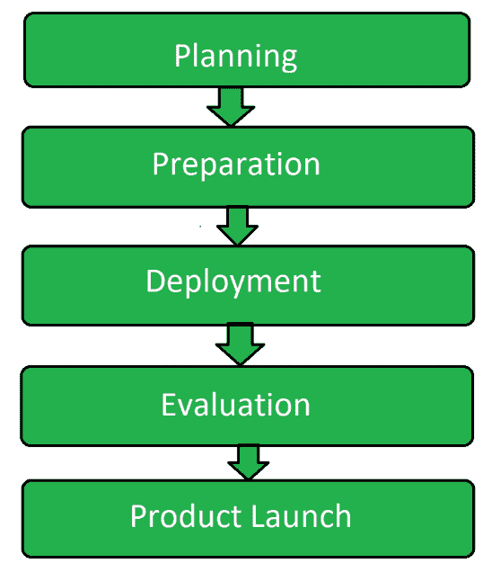

# 软件测试中的试运行测试

> 原文:[https://www . geesforgeks . org/pilot-testing-in-software-testing/](https://www.geeksforgeeks.org/pilot-testing-in-software-testing/)

试点测试是[软件测试](https://www.geeksforgeeks.org/software-testing-basics/)的类型，其中一组用户在最终启动或部署软件之前整体使用软件。该测试在实时操作条件下验证系统的组件或整个系统。试点测试的目的是评估研究项目的可行性、时间、成本、风险和绩效。

**试点测试的目标:**
试点测试的目标是:

*   评估可行性、成本和其他属性。
*   更好地利用时间和资源。
*   找出最终用户对软件的反应。
*   去发现软件是否成功。
*   为开发团队提供另一个机会。

**试点测试的必备条件:**
进行试点测试的主要必备条件是:

1.  **Appropriate Environment:** 
    Any testing process requires the appropriate environment. It is an essential requisites for performing the testing successfully. Same thing is with pilot testing. To perform pilot testing wee need such a environment what a real time user would have. After that the proper hardware and software have to be present. Therefore, it is essential to build the same situation for the testing process what end users would have to face. 
2.  **Correct group of Testers:** 
    During performing the pilot testing, the testing team manager has to ensure that there are correct group of testers that actually represent the target audience. If the correct group is not selected then pilot testing can’t be performed successfully. 
3.  **Adequate Planning:** 
    Planning is a must when it comes to any type of testing or development. While performing the pilot testing it has to be ensured that all resources are in place in the right measure. All the attributes right from manpower to equipment should be sufficient and there should not be shortage of any. In addition to this, planning leads to the creation of suitable test scenarios that are useful in creating the test environment. 

**中试流程:**

1.  **规划:**
    这是试点测试的第一步，包括创建与测试流程相关的各种计划。这是测试过程的主要部分，因为所有进一步的步骤都源于它，并且与它有很大的关系。

2.  **准备:**
    一旦规划完成，那么为测试过程收集不同属性的准备工作就完成了。为了成功地进行测试，还需要做更多的准备。在此步骤中选择终端用户组。

3.  **部署:**
    一旦所有的准备工作完成，并且选择了一组终端用户，那么软件就被部署了。每一个终端用户被保留就是目标受众将面临的这样的状况。

4.  **评估:**
    现在从测试人员组评估结果，记录软件的响应。如果软件满足要求的任务，则采取进一步的步骤。

5.  **产品发布:**
    一旦完成测试过程的评估，发现软件符合最终用户的要求，那么软件就上市了。

**中试优势:**

*   有助于猜测成功率。
*   它完善了软件。